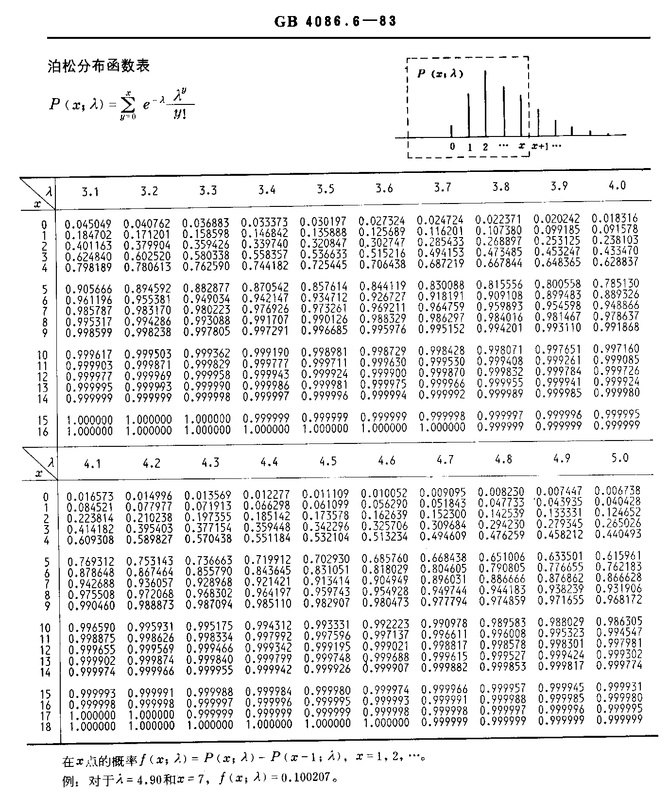

# 概率与统计学习笔记

---

### 省略部分:描述，古典，集合，简易统计

1. 非负性
2. 规范性
3. 可加性（完全可加，有限可加）

## 公理化

**公理1:**  *概率范围*
$$
0\leq P(A) \leq1
$$
**公理2：** *穷值相加*
$$
p(Ω)=1
$$
**公理3：** *完全可加*
$$
令A_1 ,A_2,A_3…不相容\\有P(A_1+A_2+A_3+…)=P(A_1)+P(A_2)+P(A_3)+…
$$

*由公理推导：*

**性质1：** *无限可加性*
$$
\begin{aligned}
有P(\phi)&=0\\
Ω&=Ω+\phi+\phi+\phi+…\\
\Rightarrow P(Ω)&=P(Ω+\phi+\phi+\phi+…)\\
&=P(Ω)+P(\phi)+P(\phi)+p(\phi)+…\\
\Rightarrow P(\phi)&+P(\phi)+P(\phi)=0
\end{aligned}
$$
**性质2：** *有限可加性*
$$
令A_1 ,A_2,A_3…A_n不相容\\
P(A_1+A_2+A_3+…+A_n)=P(A_1)+P(A_2)+P(A_3)+…+P(A_n)\\
证明：A_1 ,A_2,A_3…A_n,\phi,\phi…不相容\\
\begin{aligned}
P(A_1+A_2+A_3+…+A_n)&=P(A_1+A_2+A_3+…+A_n+\phi+\phi+\phi+…)\\
&=P(A_1)+P(A_2)+P(A_3)+…\\&+P(A_n)+P(\phi)+P(\phi)+p(\phi)+…\\
由性质1证明可以得知&P(\phi)+P(\phi)+p(\phi)+…=0\\
\Rightarrow P(A_1+A_2+A_3+…+A_n)&=P(A_1)+P(A_2)+P(A_3)+…+P(A_n)
\end{aligned}
$$
**性质3：** *逆事件相加*
$$
\begin{aligned}
&P(\bar A)=1-P(A)\\
\Rightarrow &P(\bar A)+P(A)=1\\
证明&：A\cap \bar A=\phi
\quad A+\bar A=Ω\\
P(Ω)&=P(A)+P(\bar A)\\
&=1\\

\end{aligned}
$$
**性质3推论：**
$$
如果A_1 ,A_2,A_3…A_n构成完备事件组\left\{
\begin{aligned}
1.&两两不相容\\
2.&并是Ω，\\
&\Rightarrow P(A_1)+P(A_2)+P(A_3)+…+P(A_n)=1
\end{aligned}
\right.\\
\Rightarrow P(A_1+A_2+A_3+…+A_n)=P(A_1)+P(A_2)+P(A_3)+…+P(A_n)=1
$$
**性质4：**
$$
\begin{aligned}
1.\quad P(A-B&)=P(A)-P(A\! B)\\
2.\quad A\supset B \quad& P(A-B)=P(A)-P(B) 且P(A)\geq P(B)\\
证明:A=&(A-B)\cup A\!B \quad A-B和A\!B互不相容\\
P(A)=&P(A-B)+P(A\!B)\\
P(A-B)=&P(A)-P(A\!B)

\end{aligned}
$$
**性质5：** *加法*
$$
P(A+B)=P(A)+P(B)-P(A\!B)\\
\begin{aligned}
证明：A+B&=A+(B-A\!B)\\
P(A+B)&=P(A)+P(B-A\!B)\\
P(B-A\!B)&=P(B)-P(B\cap(A\!B))\\
&=P(A)+P(B)-P(A\!B)
\end{aligned}
$$

**例题**

1.P(A)=0.4,P(B)=0.3，求$ P(A\!\bar B)$。
$$
\begin{aligned}
解：\quad P(A+B)&=P(A)+P(B)-P(A\!B)\\
\Rightarrow &0.6=0.4+0.3-P(A\!B)\\
\Rightarrow &P(A\!B)=0.1\\
P(A\!\bar B)&=P(A-B)\\
&=P(A)-P(AB)\\&=0.3\\
\end{aligned}
$$
2.P(A)=P(B)=P(C)=$ \frac{1}{4}$,$P(A\!B)=0$,$ P(A\!C)=P(B\!C)=\frac{1}{16}$,

​	（1）求A,B,C至少一个发生的概率。

​	（2）求A,B,C均不发生的概率。
$$
\begin{aligned}
解：(1)\quad A\!B\!C\subset A\! B\Rightarrow& 0\leq P(A\!B\!C)\leq P(A\!B)\Rightarrow P(A\!B\!C)=0\\P(A+B+C)=&P(A)+P(B)+P(C)-P(A\!B)-P(A\!C)-P(A\!B)+P(A\!B\!C)\\
=&\frac34-0-\frac1{16}-\frac1{16}\\=&\frac58\\
(2)\quad\quad\quad\!\!\!\! P(\bar A\!\bar B\!\bar C)=&1-P(A-B-C)=\frac38\\

\end{aligned}
$$
3.盲抽球不放回，4个白球3个黑球，取3次，求至少抽到2个白球的概率。
$$
\begin{aligned}
解：古典概型&求解\\\\
\frac{C_4^2C_3^1+C_4^3}{C_7^3}&=48.6\%
\end{aligned}
$$

### 省略部分:条件概率,乘法公式

$$
\begin{aligned}条件概率&\left\{
\begin{aligned}
P(A|B)=\frac{P(A\!B)}{P(B)}\\
P(B|A)=\frac{P(A\!B)}{P(A)}
\end{aligned}
\right.\\\\
乘法公式&\left\{
\begin{aligned}
\begin{aligned}
P(A\!B)&=P(B)P(A|B)\\
&=P(A)P(B|A)
\end{aligned}
\end{aligned}
\right.
\end{aligned}
$$

### 全概率公式

**定理1**
$$
A_1,A_2,A_3…A_n是完备事件组\\
P(A_i)>0\quad P(B)=\sum_{i=1}^nP(A_i)P(B|A_i)
$$

**例题**

1.某专业有学生100人,在一次班会中所有的学生被均匀随机排在$ \boxed{1}$,$ \boxed{2}$,$ \boxed{3}$三块方阵内，其中$ \boxed{1 \quad男生15人}$，$ \boxed{2 \quad 男生10人}$，$ \boxed{3 \quad男生10人}$。全概率公式求随机出抽取一名男生几率。
$$
\begin{aligned}
解：令A_n为抽&取的是第n排的概率，B为抽取的是男生的概率。\\
P(B)=&P(A_1)P(B|A_1)+P(A_2)P(B|A_2)+P(A_3)P(B|A_3)\\
=&\frac{40}{100}\times \frac{15}{40}+\frac{50}{100}\times \frac{5}{10}+\frac{10}{100}\times \frac{5}{10}\\
=&0.45
\end{aligned}
$$
2.某工厂有四条生产线，每条生产线生产产品产量占比和不合格率发布如下表：

| 生产线一 | 生产线二 | 生产线三 | 生产线四 |
| -------- | -------- | -------- | -------- |
| 15%      | 20%      | 30%      | 35%      |
| 0.05     | 0.04     | 0.03     | 0.02     |

求在该工厂生产的产品任意抽取一件为不合格产品的概率。
$$
\begin{aligned}
解：A_n为&在生产线n抽取的产品，B为抽取的产品不合格\\
P(B)=&P(A_1)P(B|A_1)+P(A_2)P(B|A_2)+P(A_3)P(B|A_3)\\
=&0.15\times0.05+0.2\times0.04+0.3\times0.03+0.35\times0.02\\
=&0.0315
\end{aligned}
$$
3.10台收音机均匀混合，其中7台正品，3台次品。已经售卖了两台，求再卖一台是正品的概率是。
$$
\begin{aligned}
解：令B&为事件第三次抽取为正品，\\
A_0&为前面两台都是次品，\\
A_1&为前面两台一台次品，一台正品,\\
P(B)&=P(A_0)P(B|A_0)+P(A_1)P(B|A_2)\\
&=\frac{C_3^2}{C_{10}^2}\frac78+\frac{C_3^1C_7^1}{C_{10}^2}\frac68+\frac{C_7^2}{C_{10}^2}\frac58\\
&=0.7
\end{aligned}
$$

### 贝叶斯公式

**定理1**
$$
\begin{aligned}
假设A_1,A_2,A_3…A_n为完备事件&组，B为任意事件，P(A_i)>0,P(B)>0，有\\
P(A_b|B)=&\frac{\overbrace{P(A_k)P(B|A_k)}^{by乘法公式}}{\underbrace{\sum_{i=1}^nP(A_i)P(B|A_i)}_{by全概率公式}}\\
=&\frac{P(A_kB)}{P(B)}\\\\
P(A_i&):先验概率\\
P(A_i&|B):后验概率
\end{aligned}
$$
**例题**

1.某工厂有四条生产线，每条生产线生产产品产量占比和不合格率发布如下表：

| 生产线一 | 生产线二 | 生产线三 | 生产线四 |
| -------- | -------- | -------- | -------- |
| 15%      | 20%      | 30%      | 35%      |
| 0.05     | 0.04     | 0.03     | 0.02     |

求在该工厂生产的产品任意抽取一件为产品为不合格，最有可能是来自于哪条生产线。
$$
\begin{aligned}
解：A_n为在生产&线n抽取的产品，B为抽取的产品不合格\\
P(B)=&P(A_1)P(B|A_1)+P(A_2)P(B|A_2)+P(A_3)P(B|A_3)\\
=&0.15\times0.05+0.2\times0.04+0.3\times0.03+0.35\times0.02\\
=&0.0315\\
\underbrace{P(A_1|B)}_{次品由生产线1生产}=&\frac{P(A_1\!B)}{P(B)}=23.8\%\\
\underbrace{P(A_2|B)}_{次品由生产线2生产}=&\frac{P(A_2\!B)}{P(B)}=25.4\%\\
\underbrace{P(A_3|B)}_{次品由生产线3生产}=&\frac{P(A_3\!B)}{P(B)}=28.6\%\\
\underbrace{P(A_4|B)}_{次品由生产线4生产}=&\frac{P(A_4\!B)}{P(B)}=22.2\%\\
因为22.2\%&<23.8\%<25.4\%<18.6\%,\\
所以最有可&能是生产线三生产
\end{aligned}
$$

### 事件独立性

**定义**
$$
事件A发生与否对事件B发生的概率是否影响。\\
\begin{aligned}
独立事件关系：P(A|B)&=P(A)\\
变形:P(A\!B)&=\underbrace{P(B)P(A|B)}_{乘法公式}=P(A)P(B)
\end{aligned}
$$

**性质1：** *在P(A)或者P(B)为零时定义$ \boxed{P(A\!B)=P(A)P(B)时A与B独立}$依旧成立*
$$
\begin{aligned}
证明：设P(A&)=0\\ A\!B\subset& A \Rightarrow 0\leq P(A\!B)\leq P(A)=0\\
\Rightarrow& P(A)=0\\
\Rightarrow& P(A)P(B)=0=P(A)\\
\Rightarrow& P(A\!B)=P(B)\\
\end{aligned}
$$

**性质2:** *$ \phi $和Ω与任意事件独立*

1. $ \phi $是不可能事件，必然不发生。
   $$
   \begin{aligned}
   证明：P(\phi \!A)&=P(\phi)\\&=0\\
   P(\phi)P(A)&=0\times P(A)\\&=0\\
   P(\phi \!A)&=P(\phi)P(A)
   \end{aligned}
   $$

2. Ω是必然事件，一定会发生。

$$
\begin{aligned}
证明：P(Ω \!A)&=P(A)\\
P(Ω)P(A)&=1\times P(A)\\&=P(A)\\
P(Ω \!A)&=P(Ω)P(A)
\end{aligned}
$$

**公理1：** *A与B独立，则A与$ \bar B$，$ \bar A$与B，$ \bar A$与$ \bar B$也独立。*

**公理2：** *若P(A)=0或1，则A与任意事件独立。*

### 伯努利模型

**独立实验序列：** *$ E_1,E_2,E_3……E_n$为任意独立事件。*

**n重独立实验：** *$ E_1,E_2,E_3……E_n$是n次同一事件。*

**伯努利实验：** *只有两种结果的实验（$ Ω=\{A,\bar A\}$）。*

**定理1：** *在伯努利实验中$ P(A)=1-P(\bar A)$*

**n重伯努利实验：** *进行n次伯努利实验。*

**定理2：** *在n重伯努利实验里A发生了k次有：*
$$
二项概率公式：P_n(k)=C_n^kP^k(1-p)^{n-k}=C_n^kp^kq^{n-k}\\
\boxed {\begin{aligned}
二项式PS：（a+b）^n&=\underbrace{(a+b)(a+b)(a+b)…(a+b)}_{n个}\\
&=C_n^na^n+C_n^{n-1}a^{n-1}b+C_n^{n-2}a^{n-2}b^2+…+C_n^0a^0b^n
\end{aligned}}\\
$$
**例题：**

1.某产品废品率0.1，合格率0.9每次取一个放回去，进行3次，

​	(1)求恰有一次取废品的概率。

​	(2)求恰有两次取废品的概率。

​	(3)三次都是废品。

​	(4)三次都是正品。
$$
\begin{aligned}
解：&\\
&(1)求恰有一次取废品的概率。&C_3^10.1\times 0.9^2\\

&(2)求恰有两次取废品的概率。&C_3^20.1^2\times 0.9\\

&(3)三次都是废品。&C_3^30.1^3\quad\quad\quad\!\!\!\\

&(4)三次都是正品。&C_3^00.9^3\quad\quad\quad\!\!\!\\
\end{aligned}
$$

2.某彩票每周开奖一次，中奖率是十万分之一，求买十年（520次）未中奖概率。
$$
\begin{aligned}
解：
P_{520}(0)&=C_{520}^0(10^{-5})^{520}\\
&=0.99999^{520}\\ &\approx 0.9998
\end{aligned}
$$

### 随机变量

**定义1：** *X=X(Ω)是Ω上的一个实值函数，则将X成为随机变量*

**定义2：** *定义事件记为$ \{\omega|x(\omega)=a\}$，或者简写为P(x=a)*

**例题：**

1.有一个公交车站，每间隔5分钟发一次车，求乘客的候车时间范围。
$$
\begin{aligned}
解：
X\in[0,&5]\\
\boxed{\begin {aligned} P(x>0)&=1\\
P(x>6)&=0 \end{aligned}}\\
\end{aligned}
$$

**定义3：** *类似于扔骰子（1,2,3,4,5,6）这样概率随机且不连续分布的情况被称为**离散型随机变量**，反之则为**连续性随机变量**。*

### 离散随机变量及其概率分布

> - 扔骰子会有结果{1,2,3,4,5,6}
>
>   每个结果的概率均为1/6.

对于以上这个例子，我们将其记为事件X，事件取值为$ X_k（k=1,2,…,6）$。概率分布记为：
$$
\begin{array}{c|cccccc}
x & 1 & 2  & 3 & 4 & 5 & 6 \\
-&-&-&-&-&-&-&\\
P(x) & 1/6 & 1/6 & 1/6 & 1/6 & 1/6 & 1/6 \\ 
\end{array}
$$

或者：
$$
\boxed{\begin{array}{c|cccccc}
3/6\\
2/6\\
1/6&|\!|\!|\!|\!|\!|\!|\!|\!|\!|\!&|\!|\!|\!|\!|\!|\!|\!|\!|\!|\!&|\!|\!|\!|\!|\!|\!|\!|\!|\!|\!&|\!|\!|\!|\!|\!|\!|\!|\!|\!|\!&|\!|\!|\!|\!|\!|\!|\!|\!|\!|\!&|\!|\!|\!|\!|\!|\!|\!|\!|\!|\!&\\
-&-&-&-&-&-&-&\\
P(X)&1&2&3&4&5&6\\
\end{array}}
$$
**例题：**

1.有5个黑球3个白球，每次不放回抽取一个，找到抽到黑球为止，X为抽到的白球数目，求X概率分布。
$$
\begin{aligned}
P(x=0)&=\frac58\\
P(x=1)&=\frac38\times\frac57=\frac{15}{56}\\
P(x=2)&=\frac38\times\frac27\times\frac56\\
&=\frac{5}{56}\\
P(x=3)&=\frac38\times\frac27\times\frac16\times\frac55\\
&=\frac1{56}
\end{aligned}\\
概率分布：\begin{array}{c|cccc}
x & 0 & 1 & 2  & 3 \\
-&-&-&-&-\\
P(x) & \frac{5}{8} & \frac{15}{56} & \frac{5}{56} & \frac{1}{56} \\ 
\end{array}\\
\boxed{\begin{aligned}
验证： \ & \\
&\frac58+\frac{15}{56}+\frac5{56}+\frac1{56}=1
\end{aligned}}
$$

### 连续性概率及其密度函数

**例：**某地区2019年降雨量时间分布如下

| 序号 | 降雨量    | 天数 |                                          |
| ---- | --------- | ---- | ---------------------------------------- |
| 1    | 670~770   | 1    | \*                                       |
| 2    | 770~870   | 8    | \*\*\*\*\*\*\*\*                         |
| 3    | 870~970   | 9    | \*\*\*\*\*\*\*\*\*                       |
| 4    | 970~1070  | 19   | \*\*\*\*\*\*\*\*\*\*\*\*\*\*\*\*\*\*\*   |
| 5    | 1070~1170 | 20   | \*\*\*\*\*\*\*\*\*\*\*\*\*\*\*\*\*\*\*\* |
| 6    | 1170~1270 | 18   | \*\*\*\*\*\*\*\*\*\*\*\*\*\*\*\*\*\*     |
| 7    | 1270~1370 | 10   | \*\*\*\*\*\*\*\*\*\*                     |
| 8    | 1370~1470 | 7    | \*\*\*\*\*\*\*                           |
| 9    | 1470~1570 | 4    | \*\*\*\*                                 |
| 10   | 1570~1670 | 3    | \*\*\*                                   |

**频数分布直方图：**

**定义1：** *频数/组距=频率*

**定义2：** *所有频率之和为1*

**频率分布直方图：**

**定义3：** *频率分布直方图面积为频数*

**900mm~1200mm天数示意：**

**定义4：** *倘若我们无限采样将组距无限减小可以获得拟合该事件A的连续概率的函数关系f(x)且符合$ f(x) \geq0,a\leq b$的$ \int_a^bf(x)dx$称为该事件A的概率密度分布函数，记为X~f(x)*

**曲线拟合示意：**

**推论1：** *由定义4可知$ \int_{-∞}^{+∞}f(x)=1$*

### 分布函数

$$
F(x)=P(X\leq x)
$$

**性质1：** *$ x\in(-∞,+∞)，F(x)\in[-∞,+∞]$*

**性质2：** *F(x)不减小，$x_1<x_2,F(x_1)\leq P(x_2)$*

​				$ \lim_{x→+∞}F(X)=F(+∞)=1$

​				$ \lim_{x→-∞}F(X)=F(-∞)=0$

**性质3：** *对F(x)总为右连续，而连续型分布函数为连续。函数F(x)有可数个断点。*

**例题：** 

1.分布函数$ F(x)=\left\{
\begin{aligned}
a-e^{-λx}\ &x>0\\
0\quad\quad\quad\ \ &x\leq0
\end{aligned}\right. $且λ>0，求a
$$
\begin{aligned}
解：\lim_{x→+∞}F(X)&=F(+∞)=1\\
F(+∞)&=\lim_{x→+∞}(a-\frac1{e^{λx}})=a\\
a&=1
\end{aligned}
$$
2.已知x分布为在$ \begin{array}{c|cccccc}
X&-1&2&3\\P&\frac12&\frac13&\frac16\end{array}$求$ F(x)=P(X\leq x)$

 

$$
\begin{aligned}
解：\quad &x<-1 \  \ F(x)=P(X\leq x)=0\\
-1\leq &x<2 \quad \  F(x)=P(X\leq x)=P(X=-1)=\frac12\\
2\leq &x<3 \quad  \ F(x)=P(X\leq x)=P(X=-1)+P(X=2)=\frac56\\
3\leq &x\quad \ \ \  \ \quad F(x)=P(X\leq x)=P(X=-1)+P(X=2)+P(X=3)=1\\
F(&x=)\left\{
\begin{aligned}
&0\quad\quad\quad\ \ \ x<-1\\
&\frac12 \ -1\leq x<2\\
&\frac56 \quad \ \ 2\leq x<3\\
&1 \quad\quad 3\leq x\\
\end{aligned}
\right.\\
\end{aligned}\\
分布图像如下：
$$

3.已知函数$ f(x)=\frac1{\pi(1+x^2)}$,求其$ F(x)=P(X\leq x)$
$$
\begin{aligned}
解：F(x)&=\int^x_{-∞}\frac1{\pi(1+x^2)}dt\\
&= \frac1\pi\arctan t \bigg|_{-∞}^x\\
&= \frac1\pi\arctan x+\frac 12\\
\end{aligned}
$$

4.已知连续函数$ f(x)=\left\{
\begin{aligned}
&-\frac12x+1\quad 0\leq x\leq2\\& \quad \quad0\quad \quad \quad \quad 其他
\end{aligned}
\right.$，求其$ F(x)=P(X\leq x)$
$$
\begin{aligned}
解：\quad x<0时,F(x)&=\int_{-∞}^{x}0dt=\int_{-∞}^{0}0dt=0;\\
0\leq x<2时,F(x)&=\int_{-∞}^{x}0dt=\int_{-∞}^{0}0dt+\int_{0}^{2}(-\frac12t+1)dt\\
&=-\frac14x^2+x;\\
2\leq x时,\quad\quad F(x)&=\int_{-∞}^{x}0dt\\
&=\int_{-∞}^{0}0dt+\int_{0}^{2}(-\frac12t+1)dt+\int_{2}^{+∞}0dt\\
&=1;\\
\end{aligned}
$$

4.已知连续函数$ F(x)=\left\{
\begin{aligned}
0\quad\quad\ \ &x<0\\Ax^2 0\leq &x<1\\1\quad 1\leq &x
\end{aligned}\right.$求$ F(x)=P(X\leq x)$
$$
\begin{aligned}
解：\quad \lim_{x→1^-}Ax^2=A=F(1)=1
\end{aligned}
$$

### 0-1分布

$$
\begin{array}{c|cccccc}
x & 0 & 1\\
-&-&-\\
P(x) & p&1-p \\ 
\end{array}\\\quad\\
P\{X=k\}=P^k(1-p)^{1-k}\quad k=0,1
$$

**定义1：** *0-1分布为x取值只有0和1的二项分布*

**例题：**

1.某产品废品率p=10%，其产品状况分布为$  f(x)=\left\{
\begin{aligned}
1(合格)\\0(废品)
\end{aligned}
\right.$，求其$ F(x)=P(X\leq x)$
$$
\begin{aligned}
解：P(0)&=p=10\%\\
P(1)&=1-p=90\%
\end{aligned}
$$

### 几何分布

**定义1：** *某事件（发生概率为p）==首次发生==的概率，记为X~G(p)*
$$
P\{X=k\}=(1-p)^{k-1}
$$
**例题：**

1.某狙击手射击命中概率为$ \sigma$,求他命中时的射击次数X分布
$$
\begin{aligned}
解：P\{X=k\}=0.4^{k-1}0.6 \quad k=0,,1,2,3,4,……
\end{aligned}
$$

### 二项分布

**定义1：** *P(A)=p，进行n次试验，发生了k次$ P\{X=k\}=C^k_np^k(1-p)^{n-k}\quad k=0,1,2,3,……,n$，记为X~B(n,p)*

**性质1：** *最可能值：*
$$
1. (n+1)p不为整数时，[(n+1)p]达到最大\\
2. (n+1)p为整数时，[(n+1)p]和[(n+1)p-1]达到最大
$$
**例题：**

1.某单位安装了若干报警器，当发生情况的时候每台报警的概率是0.8，每台独立工作，若要发生危险时99%报警，至少安装多少台？
$$
\begin{aligned}
解：设x为发&生危险的时候报警的台数，n表示安装的台数\\
0.99&\leq P\{X\geq 1\}=1-P\{X=0\}\\
&=1-C_n^00.2^n=1-0.2^n\\
\Rightarrow 0.99&\leq 1-0.2^n\\
\Rightarrow n&\geq \frac{\ln0.01}{\ln0.2}
\end{aligned}
$$

### 泊松分布

**定义1：** *定义为$ P\{X=k\}=\frac{λ^k}{k!}e^{-λ}\quad k=0,1,2,3,……$的分布，记为X~P(λ)*

**性质1：** *当二项分布的$ np\geq100,np\leq10$时，可以用泊松分布近似*

**例题：**

1.电话台用户呼叫次数X~P(3)，λ=3
$$
\begin{aligned}
解：P\{X=k\}&=\frac{λ^k}{k!}e^{-λ}\\
&=\frac{3^k}{k!}e^{-λ}\\ k&=0,1,2,3,……\\
P\{X\leq 5\}&=\sum_{k=0}^5P\{X=k\}=0.916
\end{aligned}
$$
2.有一个债券营业部，有1000个账户，每个账户10万元，每个账户来提20%的概率是0.006。应该准备多少现金才能一堆95%以上用户的提款要求。
$$
\begin{aligned}
解：设X为提款用户&数量。则有X\verb|~|B(1000,0.06)\\
10w&\times 0.2=2w（元）\\
&\!\!\!\!\!\!\!\!\!\!\!\!\!\!\!\!\boxed{n=1000,p=0.006,np=6}\\
P\{2X&\leq x\}\geq0.95\\
\sum_{k=0}^{\frac x2}&\frac{6^k}{k!}e^{-6}\geq0.95\\
\frac x2&=10\\
x&=20
\end{aligned}
$$

### 超几何分布

**定义1：** *N个元素分为N~1~，N~2~两类。取n个，求属于第一类的X的个数*
$$
P\{X=k\}=\frac{C_{N_1}^kC_{N_2}^{n-k}}{C_N^n} \quad k=0,1,2,……,\min\{n,N_1\}
$$
**例题：**

1.某班100人，男60女40，取10人，求取人男生数k分布
$$
\begin{aligned}
解：&\\
&\boxed{\begin{array}{c|c}
男生60人&女生40人\\
\boxed{k人}& \boxed{10-k人}
\end{array}}\\
P&\{X=k\}=\frac{C_{60}^kC_{40}^{10-k}}{C_{100}^{10}} \\
k&=0,1,2,……,10
\end{aligned}
$$

### 均匀分布

**定义1：** *记为X~U[a,b]*
$$
f(x)=\left\{
\begin{aligned}
&\frac1{b-a} &a\leq x\leq b\\
&\quad0 &else\quad
\end{aligned}
\right.
$$
**性质1：** *其分布函数为：*
$$
F(X)=\left\{
\begin{aligned}
&\quad0 &x<a\\
&\frac{x-a}{b-a} &a\leq x<b\\
&\quad 1 &b\leq x\quad~~~
\end{aligned}
\right.
$$

**例题：**

1.公交车7点开始每15分钟一班，乘客到车站从7点到7点半均匀分布，求：

​	（1）等车时间不超过5分钟的概率；

​	（2）等车时间超过10分钟的概率；
$$
\begin{aligned}
解：设乘&客等车时间为X分钟，X\verb|~|U[0,30]\\
f(x)&=\left\{
\begin{aligned}
&\frac1{30} &0\leq x\leq 30\\
&\quad0 &else\quad
\end{aligned}
\right.\\
(1)\\
&P\{10\leq x\leq 15\}+P\{25\leq x\leq30\}=\frac5{30}+\frac5{30}=\frac13
\\(2)\\
&P\{0< x< 5\}+P\{15< x<20\}=\frac5{30}+\frac5{30}=\frac13
\end{aligned}
$$

### 指数分布

**定义1：** *记为X~Exp[λ]*
$$
f(x)=\left\{
\begin{aligned}
&λe^{-λx} &x>0\\
&\quad0 &x\leq0
\end{aligned}\quad λ>0
\right.
$$

**性质1：** *其分布函数为：*
$$
F(X)=\left\{
\begin{aligned}
&1-e^{-λx} &x>0\\
&\quad0 &x\leq0
\end{aligned}\quad λ>0
\right.
$$

**例题：**

1.有个元件，其寿命分布为$ f(x)=\left\{
\begin{aligned}
&\frac1{1000}e^{-\frac λ{1000}} &x>0\\
&\quad0 &x\leq0
\end{aligned}\quad λ>0
\right.$，某机器有三个这样的原件，其中任意损坏一个机器就会停止运行，求机器工作1000小时以上的概率。
$$
\begin{aligned}
解：\quad\quad\quad\quad\quad&\\P{X>1000}&=\int _{1000}^{+∞}\frac1{1000}e^{-\frac x{1000}}dx\\
&=-e{-\frac x{1000}}\bigg|_{1000}^{+∞}=e^{-1}\\
P(A)& =\bigg(P(x>1000)\bigg)^3=e^{-3}
\end{aligned}
$$
2.有分布X~Exp[λ]，S>0，t>0求证：P{X>5+t|X>5}=P{X>5}
$$
\begin{aligned}
解：\quad\quad\quad\quad\quad\quad\quad\quad\quad&\\
P\{X>S+t|X>S\}&=\frac{P\{\{X>S+t\}\cap\{X>S\}\}}{\{P\{X>S\}\}}\\
&=\frac{P\{X>S+t\}}{P\{X>S\}}\\
&=\frac{\int_{S+t}^{+∞}λe^{-λx}dx}{\int_{S}^{+∞}λe^{-λx}dx}\\
&=\frac{-e^{-λx}\big|^{+∞}_{S+t}}{-e^{-λx}\big|^{+∞}_{S}}\\
&=\frac{e^{-λ(S+t)}}{e^{-λS}}\\&=-e^{-λt}\\ \ \\
P{X>t}&=\int_{+∞}^tλe^{-λx}dx\\
&=-e^{-λx}\bigg|^{+∞}_t\\
&=-e^{-λt}\\
&=P\{X>S+t|X>S\}\\
\end{aligned}\\
$$

### 正态分布

**定义1：** *记为X~N(μ,σ^2^)*
$$
\phi(x)=\frac1{\sqrt {2\pi}\sigma}e^{-\frac{(x-\mu)^2}{2\sigma^2}}\quad x\in(-∞，+∞)
$$
**定义2：** *标准正态记X~N(0,1)*

**性质1：** *其分布函数为：*
$$
\Phi(X)=\frac1{\sqrt{2\pi}\sigma}\int_{-∞}^xe^{-\frac{(t-\mu)^2}{2\sigma^2}}dt
$$
**性质2：** *y=φ(x)的图像以x=μ为对称轴，以x轴为渐近线*

**性质3：** *标准正态分布函数为：*
$$
\Phi(X)=\frac1{\sqrt{2\pi}}\int_{-∞}^xe^{-\frac{t^2}{2}}dt\\\boxed{
1.\Phi_0(x)=\Phi_0(-x)\\
2.\Phi_0(-x)=1-\Phi_0(x)
}
$$

