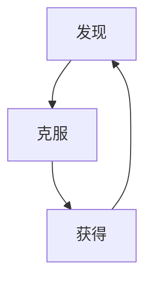

# 游戏策划

## 游戏分类

- RPG角色扮演
  - RPSG（Role-playing Simulation Game）
    - 写实，模拟
  - SRPG（Strategy Role-playing Simulation Game）
  - ARPG（Action Role-playing Simulation Game）
    - 商业表现好
  - MMORPG（Massive Multiplayer Online Role-playing Simulation Game）
  - 互动叙述游戏
    - 游戏的边界？
- ACT动作游戏
  - 平台动作游戏（Platform Action Game）
  - 卷轴动作（Side-scrolling Action Game）
  - FTG格斗游戏
  - FTG3D
  - STG射击游戏
  - TPS第三人称射击游戏
- ＡＶＧ冒险游戏
  - 文字冒险游戏
  - 视觉小说
  - ＡＡＧ动作冒险（Action　Ａｄｖｅｎｔｕｒｅ）
  - ＲＴＳ及时战略游戏（Ｒｅａｌ－Ｔｉｍｅ　Ｓｔｒａｔｅｇｙ　Ｇａｍｅ）
  - ＭＯＢＡ
  - ＲＡＣ竞速游戏（Ｒａｃｅ　Ｇａｍｅ）
  - ＰＺＬ益智游戏（Puzzle　Ｇａｍｅ）
  - ＳＰＬ体育游戏
  - Music　Game
  - Ｒｏｇｕｅｌｉｋｅ

## 策划案

- 第一步：一句话说游戏
  - 这是一款xx的xx类型的游戏
    - ⇢视角视角（人称）
    - ⇢类型
    - ⇢主题（受众，故事，视觉）
    - ⇢面向用户（年龄，性别，国籍，地区）
    - ⇢平台（用户，操作）
    - ⇢世界观（注意规则和世界的关系）
    - ⇢主角（矛盾点）
    - ⇢核心玩法（吸引玩家的玩法）
    - ⇢基本信息（名称，时长，操控，流程）
    - ⇢执行案（各个人干什么）
    - ⇢完善策划案（可选，找竞品）

## 核心玩法

- 核心系统

  - 游戏目的
  - 可操作行为
  - 障碍
 - 其他系统
    - 成长系统
    - 皮肤系统
    - 成就系统

  
