<div>			<!--块级封装-->
    <center>	<!--将图片和文字居中-->
    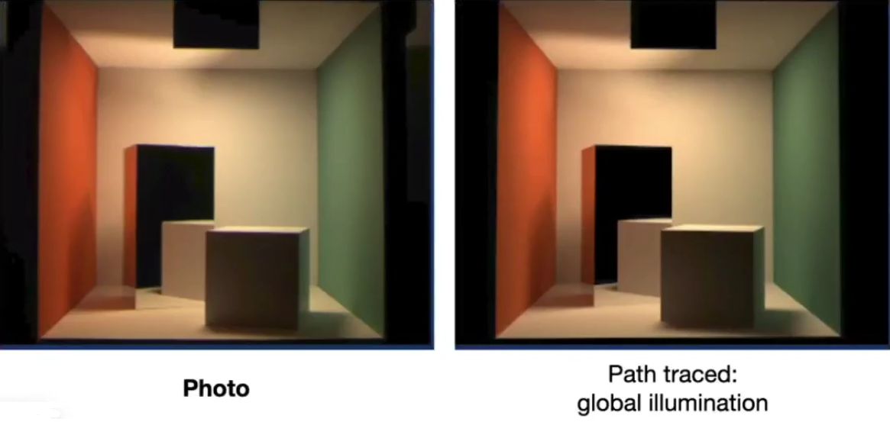
    </center>
</div>
# 计算机图形学基础入门

课程:book:：**GAMES101**

讲师:person_frowning:：**闫令琪**

## :star2:目录

[TOC]

## 2D图形的基本变换（2D Transformation）

### 图像的缩放(Scale)


$$
\begin{aligned}
x^,&=s_xx \\
y^,&=s_yy\\
\begin{bmatrix}
x^, \\
y^, \\
\end{bmatrix}
&=
\begin{bmatrix}
s_x & 0\\
0 & s_y\\
\end{bmatrix}
\begin{bmatrix}
z\\
y\\
\end{bmatrix}
\end{aligned}
$$

### 图像的对称(Reflection)


$$
\begin{aligned}
x^,&=-x \\
y^,&=y\\
\begin{bmatrix}
x^, \\
y^, \\
\end{bmatrix}
&=
\begin{bmatrix}
-1 & 0\\
0 & 1\\
\end{bmatrix}
\begin{bmatrix}
z\\
y\\
\end{bmatrix}
\end{aligned}
$$

### 图像的切变(Shear)


$$
\begin{bmatrix}
x^, \\
y^, \\
\end{bmatrix}
=
\begin{bmatrix}
1 & a\\
0 & 1\\
\end{bmatrix}
\begin{bmatrix}
x\\
y\\
\end{bmatrix}
$$

### 图像的旋转(默认沿原点逆时针,Rotation)


$$
R_\theta
=
\begin{bmatrix}
\cos\theta & -\sin\theta\\
\sin\theta & \cos\theta\\
\end{bmatrix}
$$


### 线性变换矩阵归纳

**标准形式：**
$$
\begin{bmatrix}
x^, \\
y^, \\
\end{bmatrix}
=
\begin{bmatrix}
a & b\\
c & d\\
\end{bmatrix}
\begin{bmatrix}
x\\
y\\
\end{bmatrix}
$$
**缩放：**
$$
\begin{bmatrix}
x^, \\
y^, \\
\end{bmatrix}
=
\begin{bmatrix}
s_x & 0\\
0 & s_y\\
\end{bmatrix}
\begin{bmatrix}
x\\
y\\
\end{bmatrix}
$$
**切变：**
$$
\begin{bmatrix}
x^, \\
y^, \\
\end{bmatrix}
=
\begin{bmatrix}
k & a/k\\
0 & k\\
\end{bmatrix}
\begin{bmatrix}
x\\
y\\
\end{bmatrix}
$$
**旋转：**
$$
\begin{bmatrix}
x^, \\
y^, \\
\end{bmatrix}
=
\begin{bmatrix}
\cos\theta & -\sin\theta\\
\sin\theta & \cos\theta\\
\end{bmatrix}
\begin{bmatrix}
x\\
y\\
\end{bmatrix}
$$

### 移动(Transilation)与齐次坐标


$$
\begin{bmatrix}
x^, \\
y^, \\
\end{bmatrix}
=
\begin{bmatrix}
a & b\\
c & d\\
\end{bmatrix}
\begin{bmatrix}
x\\
y\\
\end{bmatrix}
+
\begin{bmatrix}
t_x\\
t_y\\
\end{bmatrix}
$$
**图像的移动无法用线性变换归纳！但是我们可以这样解决：**
$$
\begin{bmatrix}
x^, \\
y^, \\
\omega^,\\
\end{bmatrix}
=
\begin{bmatrix}
a & b & t_x \\
c & d & t_y \\
0 & 0 & 1 \\
\end{bmatrix}
\begin{bmatrix}
x\\
y\\
1\\
\end{bmatrix}
=
\begin{bmatrix}
x+t_x\\
y+t_y\\
1\\
\end{bmatrix}
$$

$$
通常，我们知道：\\
\boxed{
1.矢量+矢量=矢量\\
2.点-点=矢量\\
3.点+矢量=点\\
4.点+点=？？
}\\
基于矩阵
\begin{bmatrix}
x\\
y\\
\omega\\
\end{bmatrix}在点相加后成为\begin{bmatrix}
x/\omega\\
y/\omega\\
1\\
\end{bmatrix}
(\omega\ne0)
$$

**所以点的相加得到的是两个点的终点！简单总结：**

**移动：**
$$
T_{s_x,s_y}
=
\begin{bmatrix}
1 & 0 & t_x \\
0 & 1 & t_y \\
0 & 0 & 1 \\
\end{bmatrix}
$$
**缩放：**
$$
s_{(s_x,s_y)}
=
\begin{bmatrix}
s_x & 0 & 0 \\
0 & s_y & 0 \\
0 & 0 & 1 \\
\end{bmatrix}
$$
**旋转：**
$$
s_{\alpha}
=
\begin{bmatrix}
\cos\alpha & -\sin\alpha & 0 \\
\sin\alpha & \cos\alpha & 0 \\
0 & 0 & 1 \\
\end{bmatrix}
$$

### :fire:认识逆变换

**对任意M的变换存在逆变换M^-1^，在数理意义上，逆变换相当于乘于逆矩阵。**


### 变换的组合


**想要完成上面的变换，我们需要将变换拆解**


**变换的顺序很重要！**


**看来变换的处理不满足交换律。**
$$
R_k·T_{(s_x,s_y)}\ne T_{(s_x,s_y)}·R_k
$$
**但是矩阵满足结合律：**
$$
W_1·(W_2·W_3)=(W_1·W_2)·W_3
$$


**而对于齐次坐标而言：**
$$
\begin{aligned}
T_{1,0}·R_{45°}\begin{bmatrix}x\\y\\1\end{bmatrix}
&=
\begin{bmatrix}
1 & 0 & 1 \\
0 & 1 & 0 \\
0 & 0 & 1 \\
\end{bmatrix}
\begin{bmatrix}
\cos k & -\sin k & 0 \\
\sin k & \cos k & 0 \\
0 & 0 & 1 \\
\end{bmatrix}
\begin{bmatrix}x\\y\\1\end{bmatrix}\\
&=
\begin{bmatrix}
\cos k & -\sin k & 1 \\
\sin k & \cos k & 0 \\
0 & 0 & 1 \\
\end{bmatrix}
\begin{bmatrix}x\\y\\1\end{bmatrix}\\
\end{aligned}
$$
**变换顺序为==先线性变换，再仿射变换==**。

## :rainbow:特殊的旋转

**对于旋转矩阵，它的逆矩阵就是它的转置矩阵**
$$
R_{-\theta}=R_{\theta}^{-1}
$$
**对于这种矩阵，数学上称为正交矩阵**

## 三维图形变换

**简单推广二维情况就可以知道三维情况下：**
$$
\begin{aligned}
3D_{point} &=(x,y.z.1)^T\\
3D_{vector} &=(x,y.z.0)^T
\end{aligned}
$$
**进而推断存在三维齐次坐标：**
$$
\begin{bmatrix}
x^,\\y^,\\z^,\\1
\end{bmatrix}
=
\begin{bmatrix}
a & b & c & t_x \\
d & e & f & t_y \\
g & h & i & t_z \\
0 & 0 & 0 & 1\\
\end{bmatrix}
·
\begin{bmatrix}
x\\y\\z\\1
\end{bmatrix}
$$

### 对三维基本变换的归纳

**缩放：**
$$
S_{(s_x,s_y,s_z)}
=
\begin{bmatrix}
s_x & 0 & 0 & 0 \\
0 & s_y & 0 & 0 \\
0 & 0 & s_z & 0 \\
0 & 0 & 0 & 1\\
\end{bmatrix}
$$
**平移：**
$$
T_{(t_x,t_y,t_z)}
=
\begin{bmatrix}
1 & 0 & 0 & t_x \\
0 & 1 & 0 & t_y \\
0 & 0 & 1 & t_z \\
0 & 0 & 0 & 1\\
\end{bmatrix}
$$
**旋转(俯仰，侧滚，偏航)：**


$$
R_{x(\alpha)}=
\begin{bmatrix}
1 & 0 & 0 & 0 \\
0 & \cos \alpha & -\sin \alpha & 0 \\
0 & \sin \alpha & \cos \alpha & 0 \\
0 & 0 & 0 & 1\\
\end{bmatrix}
$$

$$
R_{y(\alpha)}=
\begin{bmatrix}
\cos \alpha & 0 & \sin \alpha & 0 \\
0 & 1 & 0 & 0 \\
-\sin \alpha & 0 & \cos \alpha & 0 \\
0 & 0 & 0 & 1\\
\end{bmatrix}
$$

$$
R_{z(\alpha)}=
\begin{bmatrix}
\cos \alpha & -\sin \alpha & 0 & 0 \\
\sin \alpha & \cos \alpha & 0 & 0 \\
0 & 0 & 1 & 0 \\
0 & 0 & 0 & 1\\
\end{bmatrix}
$$

### :fire:罗德里格斯旋转分解公式（Rodrigues` Rotation Formula）

**分解沿过原点任意轴向旋转**
$$
R_{(n,\alpha)}=\cos(\alpha)I+(1-\cos(\alpha))nn^T+ \\
\sin(\alpha)\underbrace{
\begin{bmatrix}
0 & -n_z & n_y \\
n_z & 0 & -n_x \\
-n_z & n_x & 0 \\
\end{bmatrix}
}_{N}
$$

## 视图变换（View Transformation）

### 定义相机位置


**相机至少有一下属性：**

- 坐标位置(Position):$ \vec e$
- 视角朝向(Look-at / Gaze direction):$ \hat g$
- 上方向(UP direction):$ \hat t$


**相机变换？物体变换！**

- 只要相机和物体相对位置不变，变换就对成像无意义
- ==相机默认处于原点，向-z方向，以y方向为上方向==


### 相机变换

**存在相机处于坐标位置(Position):$ \vec e$，视角朝向(Look-at / Gaze direction):$ \hat g$，上方向(UP direction):$ \hat t$**


**将其移动到默认位置需要：**

- 拆解变换$ M_{view}=R_{view}T_{view}$

- 移动$ \vec e$去往原点
  $$
  T_{view}=
  \begin{bmatrix}
  1 & 0 & 0 & -x_e \\
  0 & 1 & 0 & -y_e \\
  0 & 0 & 1 & -z_e \\
  0 & 0 & 0 & 1\\
  \end{bmatrix}
  $$

- 将$ \hat g$转向-z方向

$$
R_{z(\alpha)}=
\begin{bmatrix}
x_{\hat g \times \hat t} & y_{\hat g \times \hat t} & z_{\hat g \times \hat t} & 0 \\
x_t & y_t & z_t & 0 \\
x_{-g} & y_{-g} & z_{-g} & 0 \\
0 & 0 & 0 & 1\\
\end{bmatrix}
$$

PS:可通过逆矩阵简单求得，因为旋转矩阵是正交矩阵，所以可以通过转置矩阵获得

$$
R_{view}^{-1}=

\begin{bmatrix}
x_{\hat g \times \hat t} & x_t & x_{-g} & 0 \\
y_{\hat g \times \hat t} & y_t & y_{-g} & 0 \\
z_{\hat g \times \hat t} & z_t & z_{-g} & 0 \\
0 & 0 & 0 & 1\\
\end{bmatrix} \
\stackrel{WHY?}{\Rightarrow } \
R_{z(\alpha)}=
\begin{bmatrix}
x_{\hat g \times \hat t} & y_{\hat g \times \hat t} & z_{\hat g \times \hat t} & 0 \\
x_t & y_t & z_t & 0 \\
x_{-g} & y_{-g} & z_{-g} & 0 \\
0 & 0 & 0 & 1\\
\end{bmatrix}
$$


- 将$ \hat t$转向y方向

### 正交投影变换（Orthographic Projection）


**对于正交投影，远近关系只决定遮挡，而不会影响投影后的图像大小，为了进行这样的变换需要：**

- 建立立方体
  - 定义其左表面n，右表面b，上表面高度t，下表面高度r，前表面f，后表面n
  - 即[l,r]✖[b,t]✖[f,n]
  - 注意：因为是左手系，摄像机朝向-z，所以在数值上f<n,即远<近，在逻辑上和高大低小，右大左小很不一样


- 将这个立方体变换成为位于原点的[-1,1]✖[-1,1]✖[-1,1]标准立方体

  - 首先进行位移
  - 然后进行缩放

  


$$
W_{ortho}=
\begin{bmatrix}
\frac{2}{r-l} & 0 & 0 & 0 \\
0 & \frac{2}{t-b} & 0 & 0 \\
0 & 0 & \frac{2}{n-f} & 0 \\
0 & 0 & 0 & 1\\
\end{bmatrix}
\begin{bmatrix}
1 & 0 & 0 & -\frac{r+l}{2} \\
0 & 1 & 0 & -\frac{t+b}{2} \\
0 & 0 & 1 & -\frac{n+f}{2} \\
0 & 0 & 0 & 1\\
\end{bmatrix}
$$

### :fire:透射投影（Perspective Projestion）


**透射投影符合自然规律，近大远小，可以看成是对空间范围物体进行一次挤压，然后对结果正交投影：**

- 对视锥进行挤压

  - 挤压后图形x，y会通过图中相似三角形的方法变成和近点一样

  - 于是我们可以推出：


$$
\begin{bmatrix}
    x\\y\\z\\1
    \end{bmatrix}
    \Rightarrow
    \begin{bmatrix}
    nx/z\\ny/z\\Unknow\\1
    \end{bmatrix}
    \stackrel{mult.\\by \ z}{== }
    \begin{bmatrix}
    nx\\ny\\Still\ Unknow\\z
    \end{bmatrix}
$$

  - 于是我们可以得出变换前和变换后矩阵部分的情况


$$
M_{persp\rightarrow otho}^{4\times 4}
    \begin{bmatrix}
    x\\y\\z\\1
    \end{bmatrix}
    =
    \begin{bmatrix}
    nx\\ny\\Still\ Unknow\\z
    \end{bmatrix}
$$

  - 推断出变换矩阵


$$
M_{persp\rightarrow otho}^{4\times 4}=
    \begin{bmatrix}
    n & 0 & 0 & 0 \\
    0 & 0 & 0 & 0 \\
    ? & ? & ? & ? \\
    0 & 0 & 1 & 0\\
    \end{bmatrix}
$$

  - 通过观察可知：

    - 任何近平面点不会发生任何变变化
    - 远平面的z也不会进行变化

  - 于是我们可以得出变换前和变换后矩阵的情况

    - 对于矩阵$ \begin{bmatrix}nx\\ny\\n^2\\1\end{bmatrix}$实质上和矩阵$ \begin{bmatrix}x\\y\\n\\1\end{bmatrix}$一样


$$
    M_{persp\rightarrow otho}^{4\times 4}
    \begin{bmatrix}
    x\\y\\z\\1
    \end{bmatrix}
    =
    \begin{bmatrix}
    nx\\ny\\Still\ Unknow\\z
    \end{bmatrix}
    \stackrel{replace\\z\ with\ n}{== }
    \begin{bmatrix}
    x\\y\\n\\1
    \end{bmatrix}
    \rightarrow
    \begin{bmatrix}
    x\\y\\n\\1
    \end{bmatrix}
    ==
    \begin{bmatrix}
    nx\\ny\\n^2\\n
    \end{bmatrix}
$$

  - 简化为：


$$
    \begin{bmatrix}
    0 & 0 & A & B
    \end{bmatrix}
    \begin{bmatrix}
    x\\y\\n\\1
    \end{bmatrix}
    =n^2
$$

  - 为了得出A，B我们来查看特殊情况：

    - 已知远平面的点z坐标依旧不变

    - 且远平面的中心点(0,0,f)的x，y坐标也不变化


$$
\begin{bmatrix}
      0\\0\\f\\1
      \end{bmatrix}
      \Rightarrow
      \begin{bmatrix}
      0\\0\\f\\1
      \end{bmatrix}
      ==
      \begin{bmatrix}
      x\\y\\f^2\\f
      \end{bmatrix}      
$$

- 得出方程式：

$$
      \begin{cases}
      An+B=n^2\\
      Af+B=f^2 \\
      \end{cases}
      \Rightarrow
      \begin{cases}
      A=n+f\\
      B=-nf\\
      \end{cases}
$$

  - 代入A，B就可以得到结果


$$
M_{persp\rightarrow otho}^{4\times 4}=\begin{bmatrix}n & 0 & 0 & 0 \\0 & 0 & 0 & 0 \\0 & 0 & n+f & -nf \\0 & 0 & 1 & 0\\\end{bmatrix}
$$

- 然后将变换完成的立方体进行正交投影

## 三角形的光栅化

### :fire:定义视锥


- **长宽比：**长度除宽度
- **垂直/平行可视角度：**锥底上与上方向相互垂直/平行的线在锥面上投影出的角度

**通过这些我们可以变换投影矩阵的相似三角形:**


$$
\tan{\frac {fovY}2}=\frac Y{|n|}
$$

$$
aspect=\frac rt
$$

### 什么是光栅化？

**现在我们拥有一个包含所有物体数据的([1,-1],[1,-1],[1,-1])立方体和一块被我们定义好的屏幕，屏幕上存在大量将会构成图像的像素，将图形转化为像素，这一步就是光栅化**

**对本课抽象概念的像素有以下定义：**

- 像素为平面正方形
- 像素有R，G，B三个属性，分别掌管一种颜色

**对本节课的屏幕空间有以下定义方案：**


- 像素坐标都写为(x,y)形式，每个像素单位为1
  - Eg.蓝色像素坐标为(2,1)
- 所有像素存在于([0,width-1],[0,height-1])空间内
- 像素中心位于(x+0.5,y+0.5)范围内
- 屏幕空间位于([0,width],[0,height])范围内

### 如何光栅化？

- 视口变换（Ciewport Transformation）

  - 先不管z

  - 将立方体x，y变形为width，height

  - 立方体左下角变为屏幕左下角(0,0)

  - 变形方程为


$$
M_{viewport}=
    \begin{bmatrix}
    \frac{width}2 & 0 & 0 & \frac{width}2 \\
    0 & \frac{height}2 & 0 & \frac{height}2 \\
    0 & 0 & 1 & 0 \\
    0 & 0 & 0 & 1\\
    \end{bmatrix}
$$

- 三角形（Trianger）的优势

  - 三角形是最基础的多边形
  - 三角形必定是平面图形
  - 三角形的内外明确，不存在凹形挖孔情况
  - 可以利用重心坐标为三角形插值

### 采样式光栅化（Sampling）

**简单理解来说，采样就是对给定输入值求输出的过程，我们这里的采样指利用屏幕中心对图形采样**


**我们只需要判断屏幕中心是否位于某个三角形内即可,定义函数：**
$$
inside(t,x,y)\begin{cases}
1\ \ point(x,y)in \ triangle \ t\\
0\ \ otherwise\\
\end{cases}
$$

```c
for (int x=0 ; x<xmax ; ++x)
    for(int y=0 ; y<ymax ; ++y)
        image[x][y] = inside(tri
    					x+0.5,
                        y+0.5);
```

**那么如何实现inside()函数？**


在上图里我们通过将Q与P~1~，P~2~相互叉乘的方法解决了判断Q位于P~1~，P~2~的哪一侧的问题，同样，我们只要将这个方法重复3次就可以判断Q是否被P~1~，P~2~，P~3~包围。

**如果点位于三角形边界上怎么办？**


**一般来说有两种解决方法：**

- 不做处理（忽略这一个像素）
- 特殊处理（两个三角形都是，或者是最后遍历的那个三角形，或者……）
- OpenGL和DX的解决方法是上边和左边算，下边和右边不算（较为复杂）

**显然，很多情况下，我们不需要遍历所有的屏幕空间来查看一个三角形，为三角形找一个包裹它的较小的矩形是一个不错的想法**


- 这个被大概选择的区域叫三角形的轴向包围和
- 获得这个区域只需要分别获得三个点中最小的x，最大的x，最小的y，最大的y即可

**有时候某些窄长倾斜的三角形会让包围和也难以解决，这个时候我们可以考虑仅遍历这个三角形范围内每行来解决问题**


## 反走样与深度缓冲


**现在我们有了这样的三角形，但显然这不是我们希望看到的，我们将这种因为采样量造成的扭曲称为瑕疵（Artifacts），大概有这些：**

- 边缘的走样（Jaggies）
- 条纹图案变成摩尔纹（Moire）
- 动画视频里的车轮效应
- 还有很多很多……

### 反走样？

**模糊图像后再栅格化是一种方法**


### 频域（FrequencyDomain）

**正弦函数是一种常用的函数，其中的f表示频率**


**利用傅里叶级数展开我们可以将正弦函数拟近方波函数**


$$
f(x)=\frac A2+\frac {2A\cos(tw)}{\pi}-\frac {2A\cos(3tw)}{3\pi}+\frac {2A\cos(5tw)}{5\pi}-\frac {2A\cos(7tw)}{7\pi}+...
$$
**同样的采样间隔可能对高频信号采样不足**


**这种情况导致的信号失真就是走样**


### 傅里叶变换（Fourier Transform）

**滤波：**将特定频率上的波段抹掉

**傅里叶函数：**可以将一个函数从时域变为频域，下图右侧为左侧的傅里叶函数变换


**高通滤波器：**去掉低频区域，只保留高频区域的滤波器，下图的右边就是去掉低频信号的结果，左边是用逆傅里叶变换得到的结果，可以看到结果多是边界


**低通滤波器：**只保留低频区域的滤波器，效果如下图


**卷积：**将一组数字的相邻每部分依次用数个权值运算相加，得到新的结果。这一组数字可以称为被卷积对象，数个权值被称为**卷积核**


**卷积也可以处理图像，可以看到很像低通滤波器的效果，简单来说，时域的卷积等于频域的乘积。九分之一的作用是防止图像亮度提升**


**所以我们可以将整个采样的过程看作被采样函数乘冲激函数得到一个采样结果，左图是这个过程，右图是其傅里叶变换的结果，也就是原傅里叶结果的卷积**


**所以如果采样率不够，时域频谱就会重叠部分，也就产生了走样**


### 如何进行反走样？

- 增加采样率

- 对图形进行卷积

  - 实际上我们会使用**MSAA**抗锯齿，对像素进行更加细致的划分，如何对划分进行采样，最后的结果平均到像素

    

    

### 深度缓存（Z-Buffer）

**画家算法：**先绘制最远的三角形，然后由远及近绘制，但是在下面的情况下几乎无法判断关系


**深度缓存：**在采样同时按照像素产生深度图，遇到更接近摄像机的深度就更新，然后按照深度图来产生结果


```c++
for(each triangle T)
    for(each sample(x,y,z)in T)
        if(z<zbuffer[x,y])			//closest
            {
            framebuffer[x,y]=rgb;	//update color
			zbuffer[x,y]=z;			//update depth
        }
		else
            ;						//do nothing,this sample is occluded
```


## 着色（Shading）

对不同的物体运用不同的材质。

### 什么是B-P反射模型（Blinn-Phong Reflectance Model）

**高光（Specular highlight）：**朝向光源的区域出现的亮斑

**漫反射（Diffuse reflection）：**被光源散色区域产生的区域

**间接光照（Ambient lighting）：**被其他物体漫反射照射产生的区域


**着色是局部的！所以对一个点的着色不会使影像具有阴影。**


### B-P着色器的原理

- 实现漫反射效果

  - 漫反射是均匀分布的效果

    

  - 漫反射的明暗与入射光角度有关

    

  - 于是我们可以得到：

    

- 实现高光相

  - 高光相是接近镜面反射的区域出现的效果

    

  - p系数可以决定高光范围和效应方式

    

- 实现环境光效果

  - 环境光是周围环境的漫反射光照，但是在B-P模型下可以简单抽象为一个整数

    

- 

### 着色频率（Shading Frequencies）


- 对面单一渲染，得到棱角化效果

  

- 对每一个顶点进行一次着色，得到较为平滑的效果

  

  - 那么如何实现顶点插值？插值的核心是利用三角形面积和法向修正着色的效果

    

- 对每个像素进行着色，效果很好

  

  - 而逐像素插值就需要用到重心坐标

    

### 实时渲染管线（Real-time Rendering Pipeline）

- 导入（Input）：将图形导入到3d空间并变换
- 投影（Vertices）：将三维空间的点投影到屏幕空间
- 三角形化顶点获得图形
- 光栅化（Fragments）：将三角化图形光栅化为Fragments
- 着色（shading）：将像素染色
- 输出（Output）


## 纹理映射（Texture Mapping）

**将3D图形剥离开平摊在2D平面上就是纹理映射**

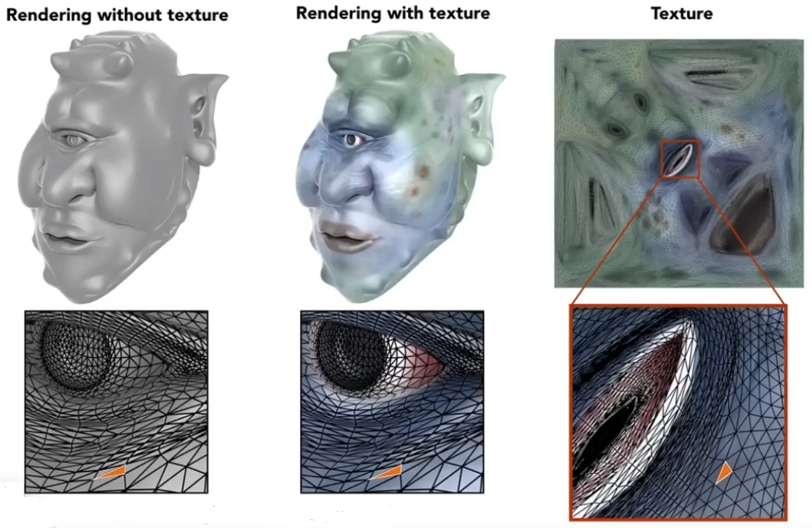

我们一般会将剥离得到的2D坐标铺在一个[0\~1,0~1]的**U-V坐标系**

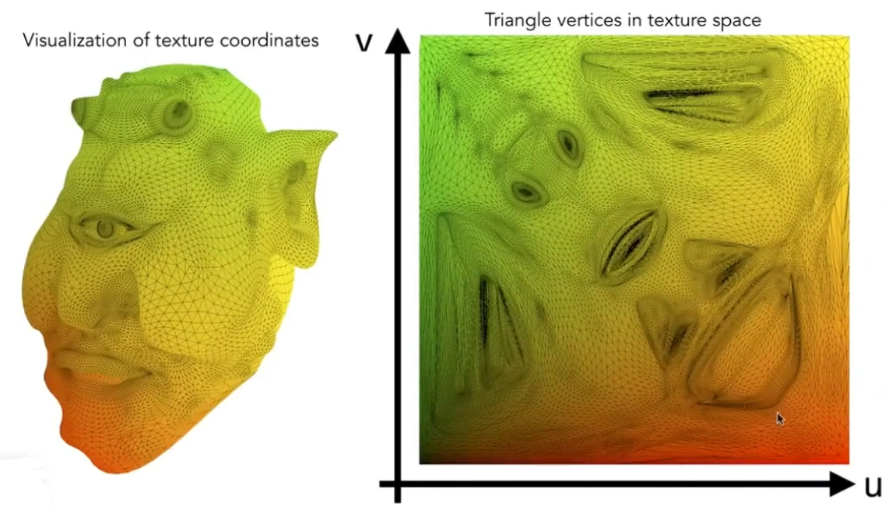

### 重心坐标

- 重心坐标配对唯一三角形

- 给定任意三角形平面内点给予唯一关于三角形顶点线性关系$ (\alpha,\beta,\gamma)$

  

- 尽管理论上定义了两个加上三角形内的条件就够了，但是定义是在三角形里面也需要三个数值。

- 我们同样可以利用面积分割计算重心坐标

  

- 用下面的方法可以将（x，y）转换为$ (\alpha,\beta,\gamma)$

$$
\alpha=\frac{-(x-x_B)(y_C-y_B)+(y-y_B)(x_C-x_B)}{-(x_A-x_B)(y_C-y_B)+(y_A-y_B)(x_C-x_B)}\\
\beta=\frac{-(x-x_C)(y_A-y_C)+(y-y_C)(x_A-x_C)}{-(x_B-x_C)(y_A-y_C)+(y_B-y_C)(x_A-x_C)}\\
\gamma=1-\alpha-\beta
$$

- 利用重心坐标我们可以将几乎所有参数平滑插值在三角形上

  


- 要注意的是重心坐标的三角形在投影到2D平面上后会变形，所以先在三维空间计算，然后投影

```c++
for each rasterized screen sample (x,y):
	(u,v)=evaluate texture coordinate at (x,y)
	texcolor=texture.sample(u,v);
	set sample`s color to texcolor;
```

### 线性插值（Bilinear interpolation）

利用双线性插值解决纹理贴图分辨率问题


$$
\begin{aligned}
&Linear \ interpolation(1D)\\
&lerp(x,v_0,v_1)=v_0+x(v_1-v_0)\\\\
&Two \ helper \ lerps\\
&u_0=lerp(s,u_{00},u_{10})\\
&u_1=lerp(s,u_{01},u_{11})\\\\
&Final \ vertucal \ lerp,ti \ get \ result\\
&f(x,y)=lerp(t,u_0,u_1)\end{aligned}
$$

### :fire:Mipmap

**如果纹理图片过大采样不足就会导致莫列纹和走样**


**尽管增加采样可以解决问题，但是我们并不希望这样，因为采样增加意味性能需求增加**

我们推荐**Mipmap**

- 它只能应用于正方形查询
- 它并不准确
- 但是它很快！


**通过简单的级数求和可以知道图片增加这么多后容量只增加了1/3**

**通过查看UV上相邻的像素距离可以简单估算像素密度**


**现在你可以求出这个面积在多少级的Mipmap上融合成为一个像素，然后对该级采样**

### 三线性插值（Trilinear interpolation）

**但是这样的突变采样行为显然可能在变级处形成割裂**


**为此我们要对Mip采样结果插值**


**结果非常好**


### 各向异性过滤

**Mipmap的局限：Overblur**


**事实上我们并不是对每一个像素采样都是矩形范围，我们时不时可能需要不一样的比例压缩**


- **EWA过滤：**通过利用其他形状分割图形多次查询

  


### 阴影映射（Shadow Mapping）

- 阴影是同时出现在摄像机视野里而不出现在光源照射范围内的区域

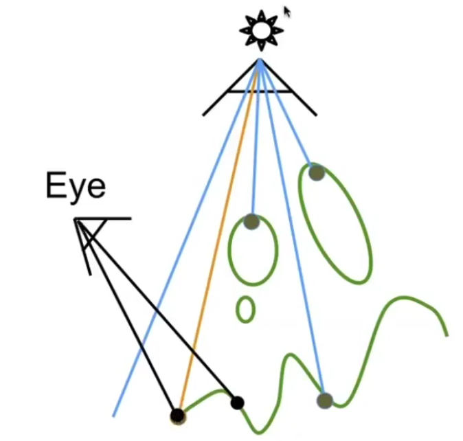

- 我们可以对将光源的视野投射出Z-buffer
- 在对目标顶点着色的时候查看它相对于光源Z-buffer的mapping，远暗近亮，没有光就是Shadow

### 硬阴影（Hard Shadow）和软阴影（Soft Shadow）

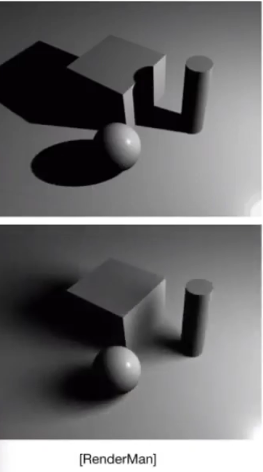

- 对于硬阴影，光源是没有大小的，凡是没有照射到的地方都是阴影
- 对于软阴影，光源是有大小的，根据光照程度会有不同的阴影表现，部分被光源照射的区域会更亮

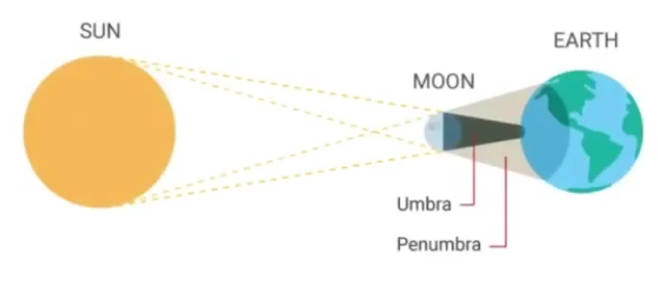

## 几何（Geometry）

### 环境贴图（Environment Map）

**我们可以通过贴图的方式保存环境来达到反射的效果**


**为了保存环境贴图我们可以将环境光保存在球面上，然后展开，但是这样容易损失极点附近信息**


**我们也可以将球上的信息投影到立方体上展开，但是这样可能会增加计算量**


### 凹凸贴图

**纹理不光可以表现图形，我们还可以利用纹理修改高度**


- 通过修改法线上的点对于法线扰动来产生复杂纹理 


### 几何表述

- 隐式几何表述
  - 表述满足该结构的关系（表达式之类的），而非具象实例（点坐标之类的）
  - 不方便表示复杂的图形
  - 不容易识别表示图形
  - 方便判断是否位于物体内或者外
- 显式几何表述
  - 直接表达参与构成结构的所有实例（点，三角形之类的）
  - 通过参数映射方法将U-V平面实例到三维空间
  - 难以判断不同物体相对空间关系

### 融合（Blend）


**利用两个极态获取之间的状态，隐式表达几何**


- A图表示初态，黑色遮挡面积为三分之一
- B图表示末态，黑色遮挡面积为三分之二
- 将二者简单平均，只能获得blend（A，B）的结果（遮挡，半遮挡，未遮挡），并不能表示实际中间态（遮挡二分之一）


- SDF（A）意为对A的有向距离函数，意为在此处相对边界的距离和方向（对于本例是遮挡区域还是未遮挡区域），SDF（B）同理
- 对SDF（A）和SDF（B）进行blend，函数结果的零点就会在我们期望的中线位置表现为零点


- 利用此我们可以融合不同的形状


- 我们并不是总能采样到正好为零的点，但是合理采样可以解决不少这样的问题，比如水平集（Level Set）就将距离丢到格子里


- 我们甚至可以定义三维水平集

### 显式几何表述方式

- **点云（Point Cloud）：**包含（x，y，z）的坐标列表


- **多边形表示（Polygon Mesh）：**

  

  - **The Wavefront Object File（.obj）**文件格式

    ​	

    - v是指构成物体的所有点所在的坐标
    - vt是指构成该物体的所有纹理坐标
    - vn是指构成该物体的所有法线
    - f是对构成物体的三角形的定义，格式为：**f v1/v2/v3 vt1/vt2/vt3 vn1/vn2/vn3**

### :fire:曲线（Curves）

- 贝塞尔曲线（Bézier Curves）

  ​	

  

  - 对上图定义了四个点

  - **de Casteljau Algorithm**算法被发明用于计算这些定义产生的曲线

    

    

    - 取$ b_0b_1$线段某点$ b_0^1$，取$ b_1b_2$线段某点$ b_1^1$，使得$ b_0b_0^1:b_1b_0^1=b_1b_1^1:b_2b_1^1$
    - 连接$ b_0^1b_1^1$
    - 取$ b_0^1b_1^1$某点$ b_2^0$，使得$ b_0^1b_0^2:b_1^1b_0^2=b_0b_0^1:b_1b_0^1=b_1b_1^1:b_2b_1^1$
    - 我们认为点$ b_2^0$存在曲线$ b_0b_2$上

    


    $$
    <Empty \space Math \space Block>
    $$

  - 为此我们可以定义贝塞尔曲线公式
    $$
    b_0^1(t)=(1-t)b_0-tb_1\\
    b_1^1(t)=(1-t)b_1-tb_2\\
    …
    $$
    **可以理解为当t为0时点$ b_1^1$无限趋近于$ b_0$，当t为1时点$ b_1^1$无限趋近于$ b_1$**

  - 归纳为**伯恩斯坦多项式（Bernstein polynomials）**

    

  

  - 贝塞尔曲线的性质：

    - 必然经过起点和终点：$ b(0)=b_0;b(1)=b_1$

    - 在起点和终点曲线矢量方向为：$ b^`(0)=x(b_1-b_0);b^`(1)=x(b_3-b_2)$，x与控制点数量有关

    - 对控制点的**仿射变换**（线性变化加常数项）可以等比例变换该贝塞尔曲线；

      - 对投影变换不是如此

    - 贝塞尔曲线必然存在于定义它的控制点的凸包（Convex Hull）内

      - **凸包（Convex Hull）：**包围若干点的最小多边形

      

- 逐段贝塞尔曲线（Piecewise Bézier Curves）

  - 原版贝塞尔曲线不好控制，也不直观（如下图）

  

  

  - 于是我们有了Piecewise Cubic Bézier曲线

    

    

    

    - 每四个控制点控制一段曲线（两个端点和两个贝塞尔曲柄）

    - 当相邻两端曲线段的始末曲柄沿着该点中心对称时这两段曲线会保持连续（参考贝塞尔曲线性质2）

      

    

- 样条（Spline）曲线

  - **定义：**由数个控制点构成的绝对平滑曲线
  - **B样条（B-Splines，Basis Splines）**
    - 具有**局部性**，指单一控制点对曲线的影响是被控制在局部的，脱离控制范围的曲线不会被该控制点影响
  - **非均匀游离B样条（NURBS）**

### 曲面（surface）

- 贝塞尔曲面（Bézier surface）

  

  

  - 这样定义一个4*4的贝塞尔曲面：

    - 先通过这些点得到四条在平行平面内的贝塞尔曲线

      

    

    - 再用垂直这些平面的平面在四条线上截出四个点来定义横向贝塞尔曲线

      

    

    - 重复采样用这些曲线构成曲面

      

    

### 对Polygon Mesh的几何处理

- 表面细分（Mesh subdivision）
- 网格简化（Mesh simplification）
- 网格规整（Mesh regularization）


### Monkey·D·Loop三角面细分（Loop Subdivision）


- 增加一定数量的Triangle

  

  

  - 取三角形每边终点，三角面数量*4

- 按照规则移动新旧顶点

  - 定义新点位置为$ P_{new}=\frac38(A+B)+\frac18(C+D)$

    

  - 对于老的顶点更新我们需要：

    - 计算出该顶点的度n
    - 计算出u：$ \frac3{16}if\ n=3,\frac3{8n}otherwise$
    - 对点更新：$ (1-n*u)*original\_position+u*neighbor\_position\_sum$

### Catmull-Clark Subdivision多边形面细分(General Mesh)

- 定义：

  - **非四边面：**边数不为4的面
  - **奇异点（Extraordinary vertex）：**度不为4的顶点

  

- 细分：对每个边和面分别取中点用线的中点连接面的中点

  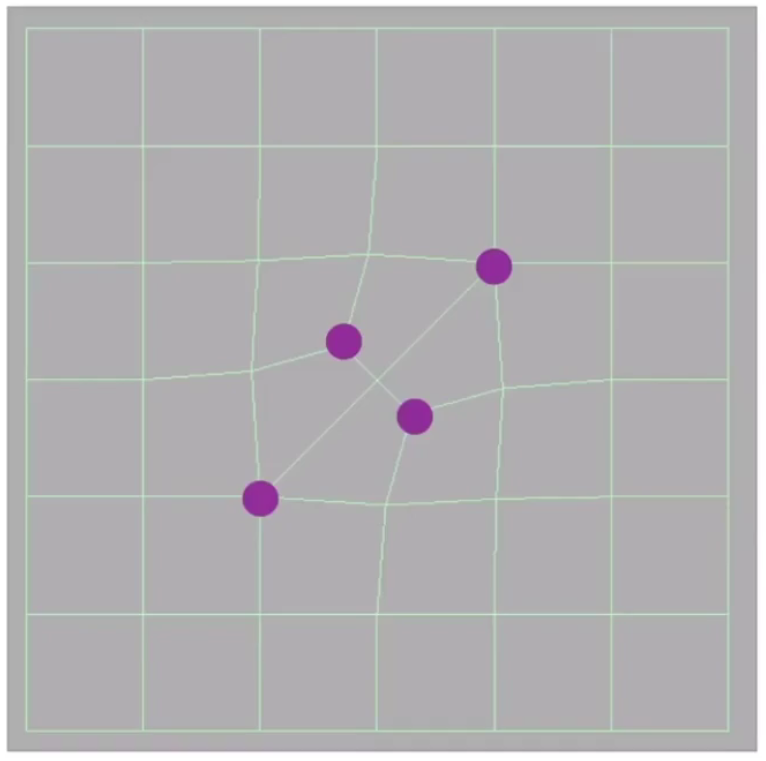

  - 增加生了细分前非四边形面个奇异点
  - 所有的非四边形都消失了

- 可以预见再次细分也不会增加奇异点的数量

- 这种细分的位置更新需要分三种情况讨论

  - 位于面中点的
  - 位于边中点的
  - 旧有的顶点

  

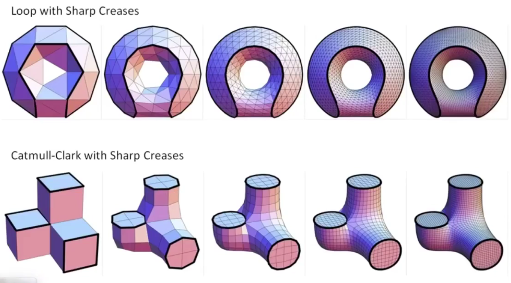

### Edge Coilops边坍缩（ Mesh Simplification减面）

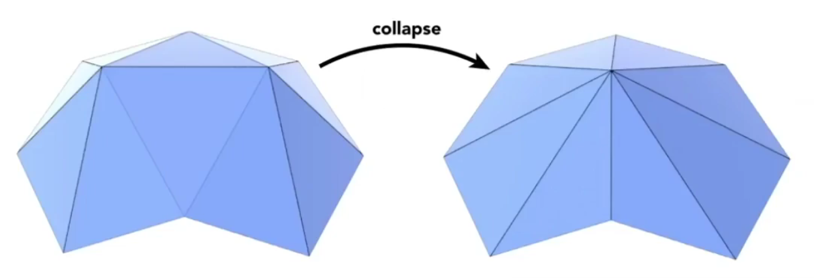

**将面缩小为0，用点代替**

### 二次误差度量（Quadric Error Metrics）


- 左图可以发现将简化后的点简单的放在平均并不能表现出结构的实际情况
- 我们可以将简化后得到的点放在到原来构成的边的距离平方和最小处

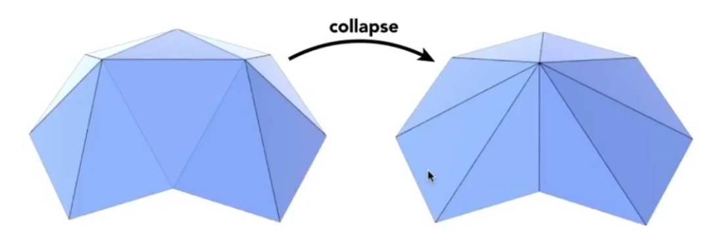

- 我们可以通过二次度量误差确定坍缩的面，使其对模型影响更小

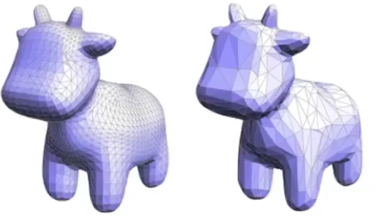

## 光线追踪（Ray Tracing）

### 传统光栅化流程的缺陷

- 难以表现软阴影（Soft shadows）
- 难以处理二次反射（Glossy reflection）
- 难以处理间接光照（Indirect illumination）

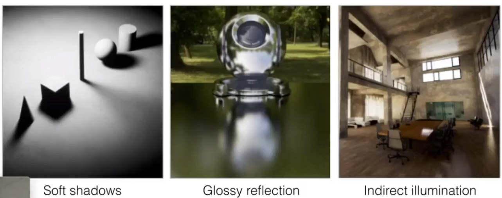

### 光线追踪基本原理

- “光线”（Light Ray）：
  - 光线沿直线传播。
  - 光线不会发生碰撞。
  - 光路可逆，==光从眼睛出发！==在经过一定反射和衰减后消失。


- 光线追踪基本：
  - 我从视点和像素连线打出一条“光线”
  - 光线到达一个顶点就将其与光源进行遮挡检定
  - 将结果返回像素 

### Whitted-Style Ray Tracing


- 我们认为“光线”具有以下性质
  - 反射
  - 透射
  - 折射
  
- 这些性质会偏折分离光线，因此我们递归的求解光线每次反射，折射，和透射效果然后将光照结果按照光路“剩余能量”作为权值进行累加

### 简单求交点


- 定义数学上的光线：

    $$
    r(t)=o+td\ \ 0\leq t<\infty
    $$

    - **o:**光线起点
    - **t：**传播时间
    - **d：**行进方向

- 求光线与球的交点

    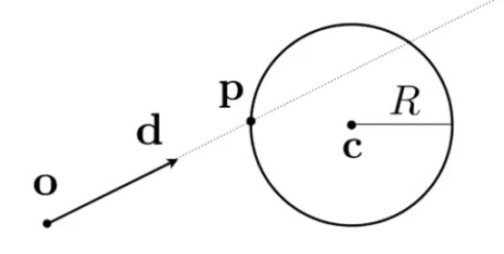

    - 光线从光源出发行进的距离：
        $$
        r(t)=o+td\ \ 0\leq t<\infty
        $$

    - 球体的隐式表现：
        $$
        p:(p-c)^2-R^2=0
        $$

    - 光线从球心出发到达的距离：
        $$
        (o+td-c)^2-R=0
        $$

    - 联立求解得：
        $$
        t=\frac{-b\pm \sqrt{b^2-4ac}}{2a}
        $$
        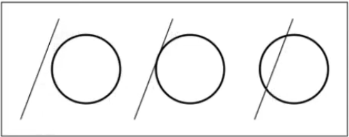

- 推广到所有隐式表现

  - 光线从光源出发行进的距离：
    $$
    r(t)=o+td\ \ 0\leq t<\infty
    $$

  - 几何体的隐式表现：
    $$
    p:f(p)=0
    $$

  - 几何体光线方程：
    $$
    f(o+td)=0
    $$

- 三角形光线求交

  - 求交流程

    1. 光线和三角形所在平面的交点
    2. 交点是否在三角形内

  - 定义平面

    - 定义一个向量和一个点

    - 向量和平面垂直，点在平面内:
      $$
      p:(p-p^,)\cdot N=0\\
      \Rightarrow ax+by+cz+d=0
      $$

    - 带入几何体光线方程得：
      $$
      t=\frac{(p^,-o)\cdot N}{d\cdot N}\ Check:0\leq t < \infty
      $$

- MT算法快速求解（Möller Trumbore Algorithm）

  

  - $ \vec{O}+t\vec{D}$可以表示光线
  - $ (1-b_1-b_2)\vec{P_0}+b_1\vec{P_1}+b_2\vec{P_2}$可以表示重心坐标
  - 两者联立可以解出光线上任意一点的重心坐标
  - 即可判断光线是否打中片元

- 缺陷

  - 运算量巨大（求交次数=光线量*片元量）

### 包围盒（Bounding Volumes）


一个完全包围了该物体所有片元的简单物体，让未进入该包围区域的光线无需对该物体所有片元求交。

- 轴对齐包围盒（Axis-Aligned Bounding Box，AABB）

  - 一个由两个三维坐标定义的长方形

  - 在2D情况考虑

    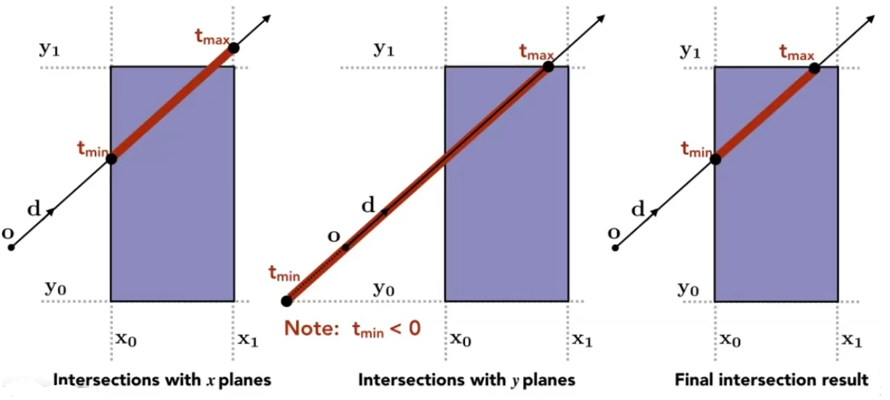

    - 对一条直线，将它在y轴产生的交点线段（左1）和它在x轴产生的交点线段（左2）进行交集就可以得出它与包围盒的交点线段。
    - **思路：**只有光线即进入了x轴交段，又进入了y轴交段光线才同时进入了两个交段，也就是包围盒

  - 延展到3D情况

    - 分别求三个平面的交线段
    - 求$ t_{enter}=max\{t_{min}\},t_{exit}=min\{t_{max}\}$得到结果
    - 如果$ t_{enter}<t_{exit}$,光线就与该盒相交

  - 特殊考虑

    - 当$ t_{exit}<0$，盒子在发射源的“后面”，没有交点
    - 当$ t_{exit}\geq0 \ and\ t_{enter}<0$,发射源在盒子里，有交点
    - **总结：**iff（当且仅当）$ t_{enter}<t_{exit}\ \&\&\ t_{exit}\geq 0$光线穿过AABB

  - 一般包围盒和AABB的区别

  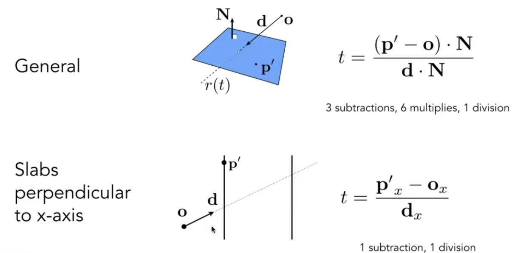

### 包围盒网格（Grid Cell）

  - 现在在空间里我们有一些片元结构

    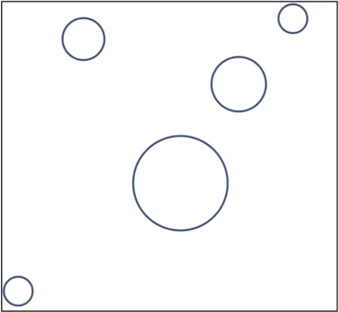

  - 我们将空间平铺上合适尺寸的网格（cell）

    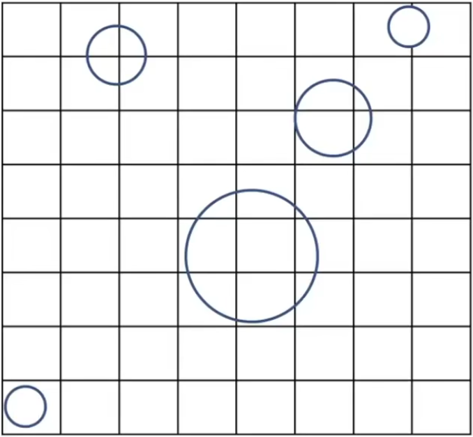

  - 网格里存在片元的部分被我们标记出

    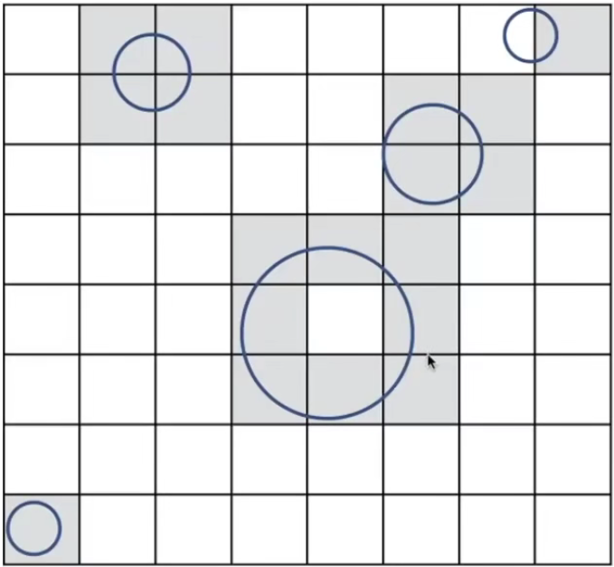

  - 对于光线我们只需要在通过存在片元的网格里对片元求交

    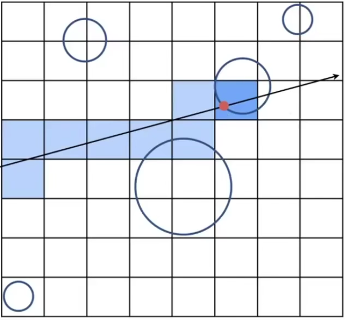

  - 划分cell依据

    - 一般发现$ \#cells=C\times \#objs$在C约等于27时最好
    - “Teapot in a stadium（操场上的茶壶）”问题——本质是空的空间太大，导致过多的与空各自求交

### 空间划分（Spatial Partit）

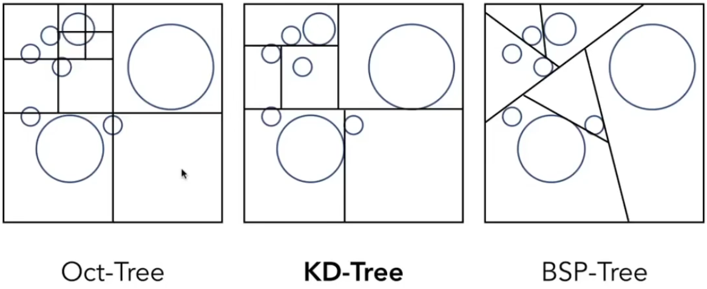

- 八叉树（Oct-Tree）
  - 对空间进行2\*2\*2均匀划分直到到达限制
  - **限制举例：**cell到达预设大小或者cell内不再有片元
- **KD-Tree**
  - 每次将空间按照规则与坐标轴对其地一分为二，直到达到限制
  
    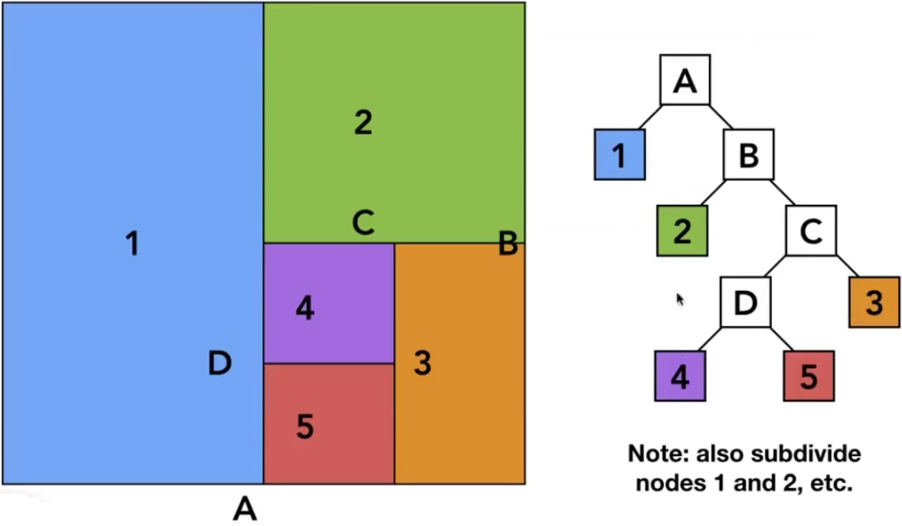
  
    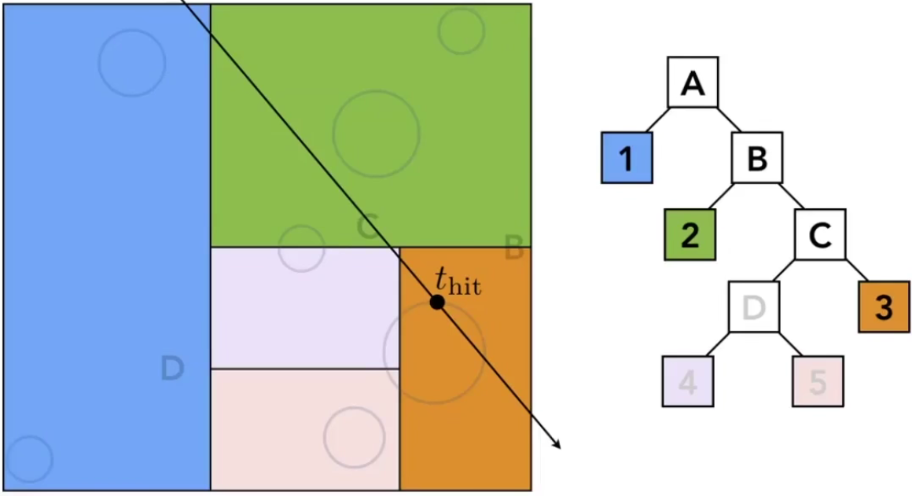
- BSP-Tree
  - 每次将空间按照规则一分为二，产生空间非AABB，直到达到限制


### :fire:物体划分（Bounding Volume Hierarchy，BVH）

- BVH的建立

  - 对每个物体建立Root节点

    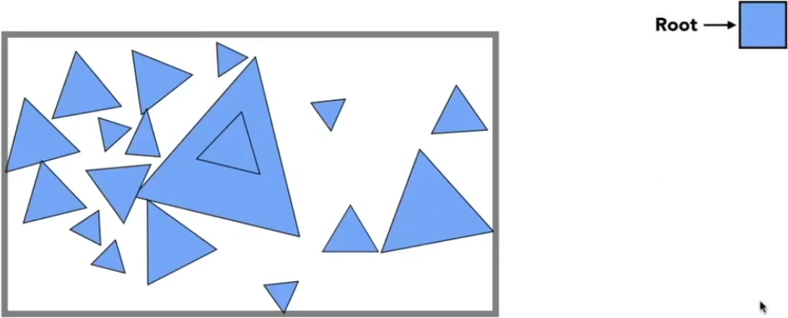

  - 在节点下对片元进行划分，为划分的区域建立AABB

    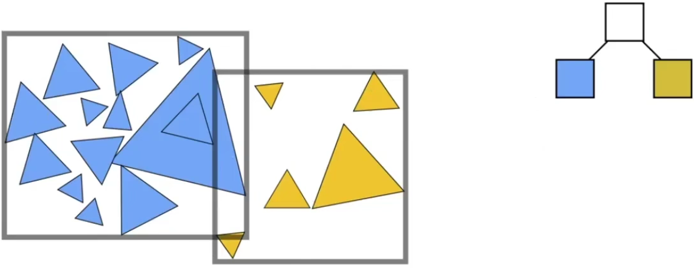

  - 就这样一直划分直到达到限制，同一个片元不会存在多个AABB内，但是不同AABB之间可以重叠

    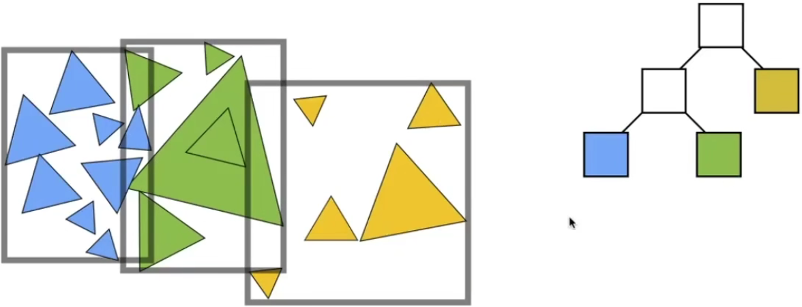

- BVH的递归

  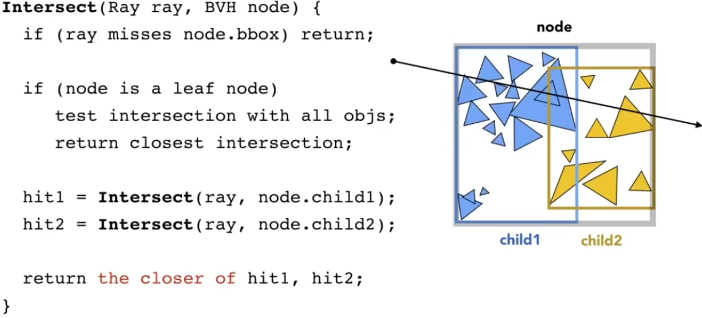

## 基础辐射度量学（Basic radiometry）

- **动机：**我们之前的所有渲染体系的辐射参数，包括衰减，反射等等都是没有任何度量理论支持的，这导致我们的光照算法再精确也无法表达正确的图像
- **内容简介：**描述光照的方法与单位，但完全基于几何光学。
  - 全新的物理量：**Radiant flux**，**intensity**，**irradiance**，**radiance**

### Radiant Energy and Flux（Power）

- **Energy**

  - 能量单位是J（焦耳）
    $$
    Q[J=Joule]
    $$

- **Flux（Power）**

  - Flux（Power）是单位时间的能量，所以单位是W（瓦特）和lm（流明）
    $$
    \Phi \equiv \frac{dQ}{dt}[W=Watt][lm=lumen]^*
    $$

  - 也可以固定单位时间，然后计算通过某区域的所有能量来定义Flux

    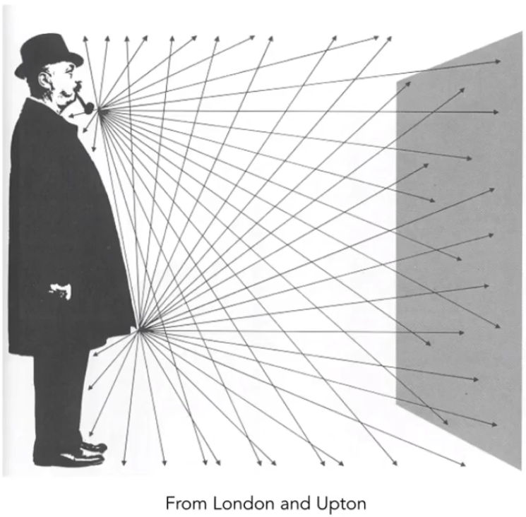

- 我们想要定义的辐射

  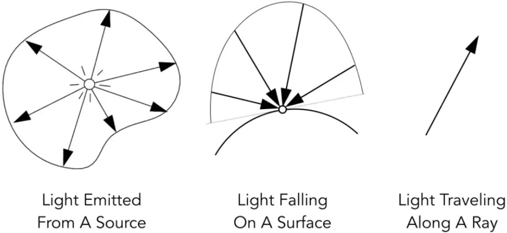

  - 光源发出的辐射:**Radiant Intensity**
  - 物体接收的辐射:**Irradiance**
  - 传播光线的辐射:**Radiance**

### Radiant Intensity

- **定义：**power per unit solid angle
  $$
  I(w)\equiv \frac{d\phi}{dw}
  $$

- **单位：**power单位除以空间角单位，就是cd（坎德拉）
  $$
   \left[\frac{W}{sr}\right]\left[\frac{lm}{sr}=cd=candela\right]
  $$

- **立体角（solid angle）**定义

  

- 对**立体角（solid angle）**微分的定义

  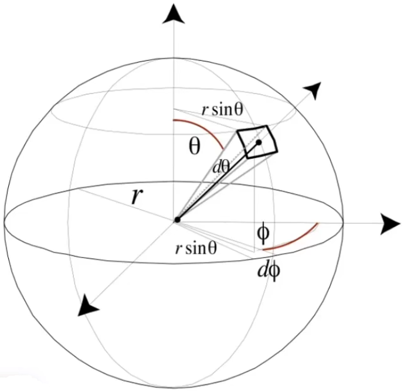
  $$
  \begin{aligned}
  dA&=(r\ d\theta)(r\ \sin{\theta}\ d\phi)\\
  &=r^2sin{\theta}\ d\theta\ d\phi\\
  dw&=\frac{dA}{r^2}=\sin{\theta}\ d\theta\ d\phi
  \end{aligned}
  $$

  - 对所有微分立体角求积分可以得到球$ S^2$
    $$
    \begin{aligned}
    \Omega &= \int_{S^2}dw\\
    &=\int_{0}^{2\pi}\int_{0}^{\pi}\sin{\theta}\ d\theta\ d\phi\\
    &=4\pi
    \end{aligned}
    $$

- Eg.现在有一个815lumens的灯，求其Radiant Intensity

  - Intensity=815lumens/4pi sr=65candelas

### Irradiance

- **定义：**power per unit area
  $$
  E(x)\equiv\frac{d\Phi(x)}{dA}
  $$

- **单位：**power单位除以面积的单位，也就是lux(勒克斯)
  $$
  \left[\frac W{m^2}\right]\left[\frac {lm}{m^2}=lux\right]
  $$
  
- 辐照面积必须是垂直光线辐照方向面积的投影

  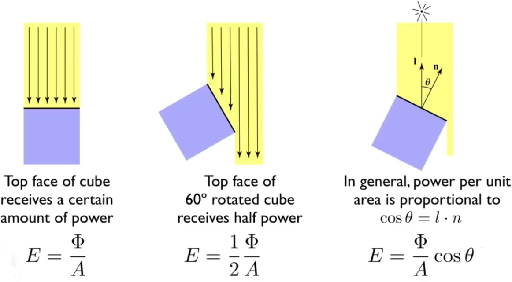

### Radiance

- **动机：**讨论光线在传播过程里的某些特性

- **定义：**power per unit solid angle,per project unit area

  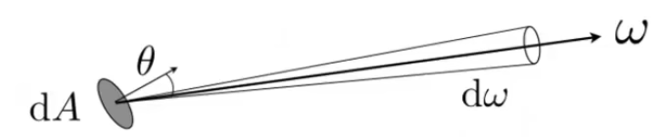
  $$
  L(p,w)\equiv\frac{d^2\Phi(p,w)}{dw\ dA\cos{\theta}}
  $$

- **单位：**power单位除以立体角和面积单位，也就是nit
  $$
  \left[\frac{W}{sr\ m^2}\right]\left[\frac{cd}{m^2}
  =\frac{lm}{sr m^2}=nit\right]
  $$

- 换个角度，我们也可以吧Radiance看成：

  - **Radiance：**Irradiance per solid angle
  - **Radiance：**Intensity per projected unit area

### :fire:双向反射分布函数(Bidirectional Reflectance Distribution Function,BRDF)

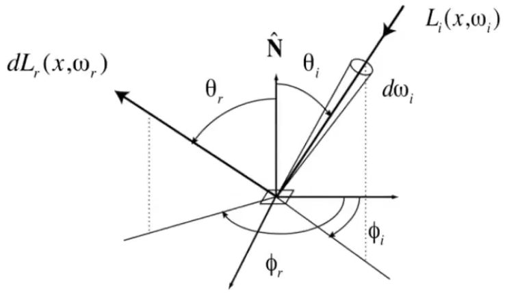

- **定义：**BRDF 描述的是任意一个出射角占入射角总能量的比例
  $$
  f_r(w_i\rightarrow w_r)=\frac{dL_r(w_r)}{dE_i(w_i)}\\
  =\frac{dL_r(w_r)}{L_i(w_i)\cos{\theta_i}\ dw_i}\left[\frac{1}{sr}\right]
  $$

- **用途：**更加全面的定义表面反射材质（材质表面单位面积反射的光是由涉及该区域的所有Radiance决定的）

  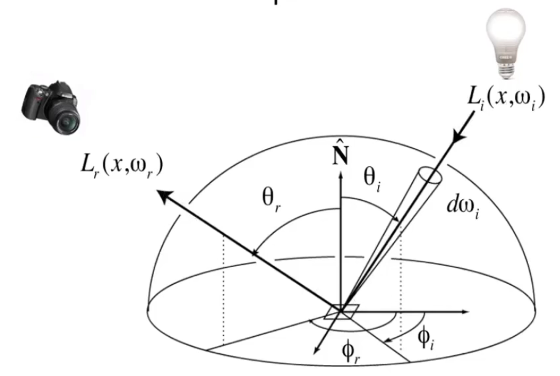
  $$
  L_r(p,w_r)=\int_{H^2}f_r(p,w_i\rightarrow w_r)
  L_i(p,w_i)\cos(\theta_i)\cos{\theta_i}dw_i
  $$
  
  
  
- 

### 渲染方程（Rendering Equation）

BRDF忽略了一件事情，那就是如果单位面积的材质会发光怎么办。在渲染方程里我们将它加入：
$$
L_r(p,w_0)=L_e(p,w_o)+ \int_{\Omega^+}L_i(p,w_i)f_r(p,w_i, w_o)L_i(n,w_i)dw_i
$$
**PS:**H^2^或者Ω^+^都是半球的意思

## :rainbow:简单概率论回顾

- **随机变量X：**一个取值不一定的变量
- **随机变量分布X ~ p(x)：**随机变量在分布范围里的分布状态
- 随机变量在分布求积分为1
- **期望E[X]：**用概率作为加权累加所有取值
- **连续概率的概率密度函数p(x)：**随机变量函数在分布范围里的分布密度
- **连续概率的期望E[X]：**$ E[X]=\int xp(x)dx$

## 蒙特卡洛路径追踪（Monte Carlo Path Tracing）

### 蒙特卡洛积分（Monte Carlo Integration）

- **动机：**数值法计算函数定积分的相似值

- **定义：**在积分域反复采样，用采样值与积分范围求平均，然后把结果相加平均来近似积分
  $$
  F_N=\frac{b-a}N\sum^N_{i=1}f(X_i) \ X_i\sim p(x)
  $$

- **通过定义我们可以知道：**

  - 越多样本越精确
  - 在x上采样在x上积分

### Whitted-Style Ray Tracing的局限

- 对于非镜面反射无法真实表现

  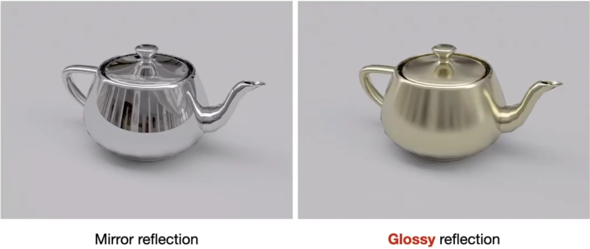

- 无法表现合适的漫反射二次反射和Color Blooding

  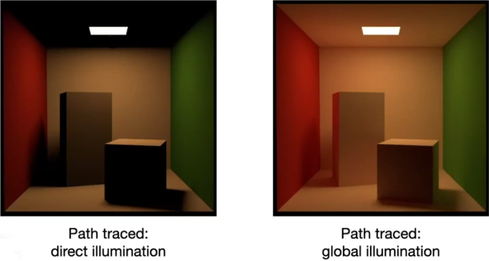

### :fire:路径追踪（Path Tracing）

- **思路：**用蒙特卡洛积分近似渲染方程的积分部分

- **实现：**对半球范围进行均匀采样
  $$
  \begin{aligned}
  L_o(p,w_o)&=\int_{\Omega^+}L_i(p,w_i)f_r(p,w_i,w_o)(n\sdot w_i)dw_i \\
  &\approx \frac1N\sum^N_{i=1}\frac{L_i(p,w_i)f_r(p,w_i,w_o)(n\sdot w_i)}{p(w_i)}
  \end{aligned}
  $$

- **进一步：**我们可以通过有限步运算逼近真实情况意味着我们可以实现算法了

  ```C++
  Lo shade(p, wo){
      Randomly choose N directions wi~pdf;
      for each wi
          Trace a ray r(p, wi);
      	if (ray r hit the light)
              Lo += (1 / N) * L_i * f_r * cosine / pdf(wi);
      return Lo
  }
  ```

- **One more thing：**尽管L~i~已经被加入反射模型，但是我们仍然不知道L~i~的具体值，为此我们递归如下
	
  ```C++
  Lo shade(p, wo){
      Randomly choose N directions wi~pdf;
      for each wi
          Trace a ray r(p, wi);
      	if (ray r hit the light)
              Lo += (1 / N) * shade(q, -wi) * f_r * cosine / pdf(wi);
      return Lo
  }
  ```


### :fire:优化

- **问题1：**每次递归$ \#rays=N^{\#bounces}$，光线采样消耗指数级增长

  - **解决：**那我们让$ N=1$不就好了吗
  - :rainbow:对于$ N\neq 1$的情况我们称为分布式路径追踪

- **问题2：**$ N=1$的话全屏不就只有噪点了吗？

  - **解决：**我们多进行几次路径追踪，然后将结果求平均就好了

    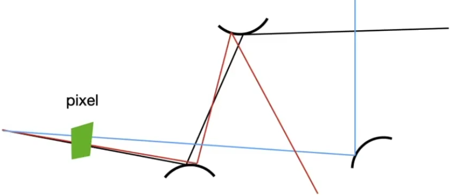

- **问题3：**递归死锁了，但是如果简单限制弹射次数又无法表现光线的能量衰减

  - **解决：**俄罗斯轮盘赌（Russian Roulette，RR）

    - 我们每次有$ P$的概率向外打出一个光线
    - 当光线打出我们就将打出结果$ \times P$
    - 当光线不打出，我们让结果返回$ 0$
    - 由此我们对结果的期望是$ E=p\times (L_o/P)+(1-P)\times 0=L_o$

  ```C++
  Lo shade(p, wo){
		Manually specify a probability P_RR;
		Randomly select ksi in a uniform dist. in [0, 1];
		if(ksi > P_RR)return 0.0;
	
		Randomly choose N directions wi~pdf;
		for each wi
		Trace a ray r(p, wi);
		if (ray r hit the light)
			return L_i * f_r * cosine / pdf(wi) / P_RR;
		 else if(ray r hit the light)
			return shade(q, wi) * L_i * f_r * cosine / pdf(wi) / P_RR;
	}
	```

- **问题4：**当我们向外每次打出光线的时候打中光源的概率不够高，也就产生了大量的噪点

  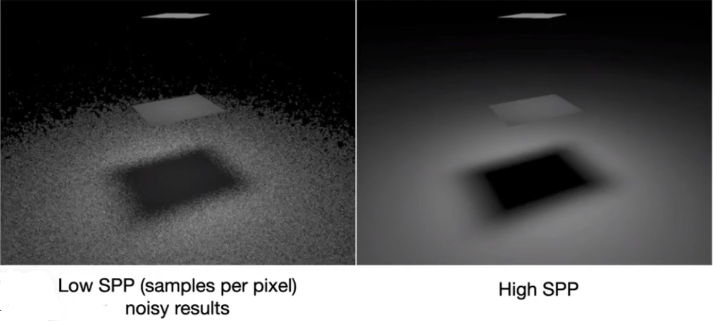

  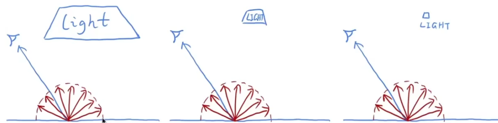

  - **思路：**我们可以对光源进行针对性积分

    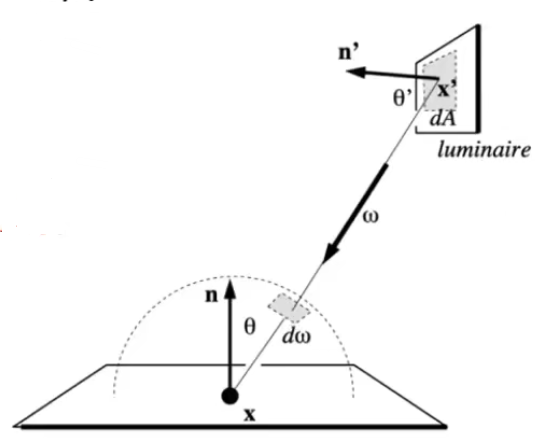

  - **解决：**我们将光源在半球上进行投影，得到的立体角为
    $$
    dw=\frac{dAcos{\theta^`}}{||x^`-x||^2}
    $$
    **重写渲染方程为：**
    $$
    \begin{aligned}
    L_o(p,w_o)&=\int_{\Omega^+}L_i(p,w_i)f_r(p,w_i,w_o)\cos{\theta}dw_i \\
    &=\int_AL_i(x,w_i)f_r(x,w_i,w_o)\frac{\cos{\theta}\cos{\theta^2}}{||x^`-x||^2}dA
    \end{aligned}
    $$
    ```C++
    Lo shade(P，Wo){
		    // Contribution from the light source.
		    Uniformly sample the light at x` (pdf_light = a/A);
		    L_ _dir=L_i*f_r* cos θ * cos θ' / abs(x' - p)^2 / pdf_light;
	      
		    // Contribution from other reflectors .
		    L_ indir = 0.0;
		    Test Russian Roulette with probability P_RR;
			Uniformly sample the hemisphere toward 
		        wi (pdf_ hemi = 1 / 2pi);
			Trace a ray r(P， wi);
			if(ray r hit a non- emitting object at q)
	          L_ indir =
	          	shade(q, -wi) * f_ _r* cos θ / pdf_ hemi / P_ _RR;
	      Return L_ dir + L_ indir;
	  }

- **问题5：**如果单独采样光源，那么这么处理光源与物体的遮挡关系？

  - **解决：**每次采样光源的时候都对该路径像其他路径一样检测碰撞就行了

    ```C++
    Lo shade(P，Wo){
    // Contribution from the 1 ight source .
    L_ dir = 0.0;
    Uniformly sample the light at x' (pdf_ light = 1 / A);
    Shoot a ray from p to x';
    If the ray is not blocked in the middle
    L_ dir = ...
    ```


## :rainbow:更多问题&追踪方案

- 更多问题
    - **点光源：**尝试用非常小的其他光源代替？
    - **如何实现采样细节？**
    - **如何选择Pdf？**参考multiple imp. sampling（MIS）
    - **如何选取随机数：**可以选择*low discrepancy sequences*
    - **如何结合光源采样和物体采样？**
    - **在像素上打出更多光线然后平均意味着什么？**让光线偏移像素中心和加权平均的猜想
    - **得到的radiance变成屏幕空间颜色：**参考gamma correction，HDR，颜色空间
    - **噪点：**噪点是无法避免的，但是我们应当尽力避免和想办法消除
    - **性能：**对于即时光线追踪，这样的算法依旧过于复杂

- 更多追踪方案

  - 单向的路径追踪（Unidirectional path tracing）
  - 双向的路径追踪（Bidirectional path tracing）
  - 光子映射（Photon mapping）
  - Metropolis light transport
  - VCM/UPBP…
- **敬畏科学，永无止境**

## 材质与外观


- 材质的区别

  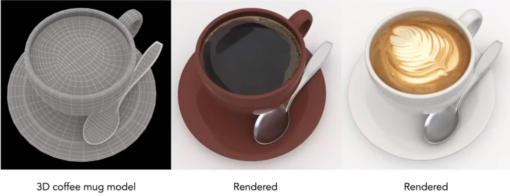

### Material==BRDF

- 漫反射（Diffuse/Lambertian）

  - **描述：**材质均匀散射

  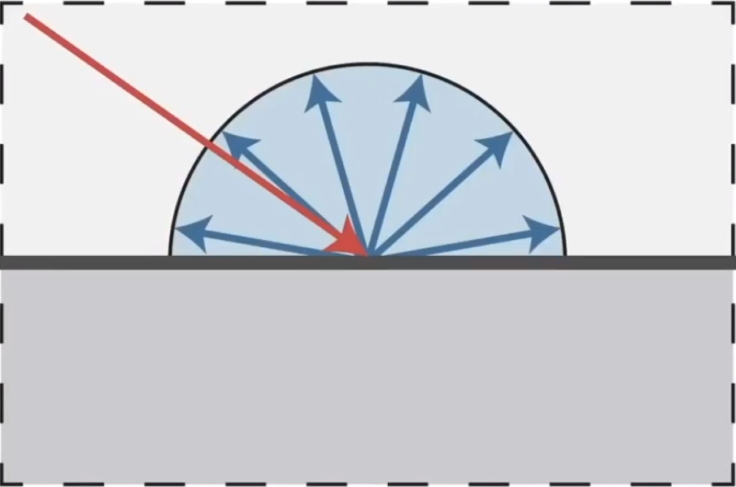
  $$
  \begin{aligned}
  L_o(w_o)&=\int_{H^2}f_rL_i(w_i)cos(\theta_i)dw_i\\
  &=f_rL_i\int_{H^2}\not(\not w_{\not i}\not)cos{\theta_i}dw_i\\
  &=\pi f_i L_i
  \end{aligned}
  $$

  - **导出：**
    $$
    f_r=\frac{\rho}{\pi}\qquad \rho\leftarrow 可以为常数也可以是四元数（RGBα）
    $$

- 金属（Glossy）

  - **描述：**材质散射具有方向性

    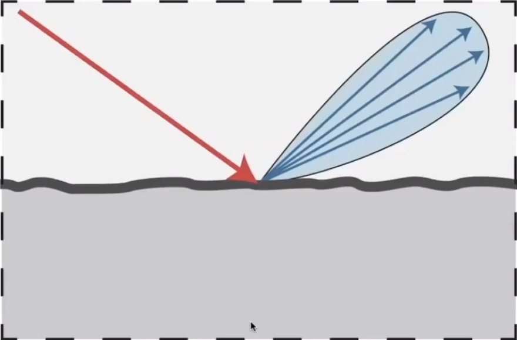

    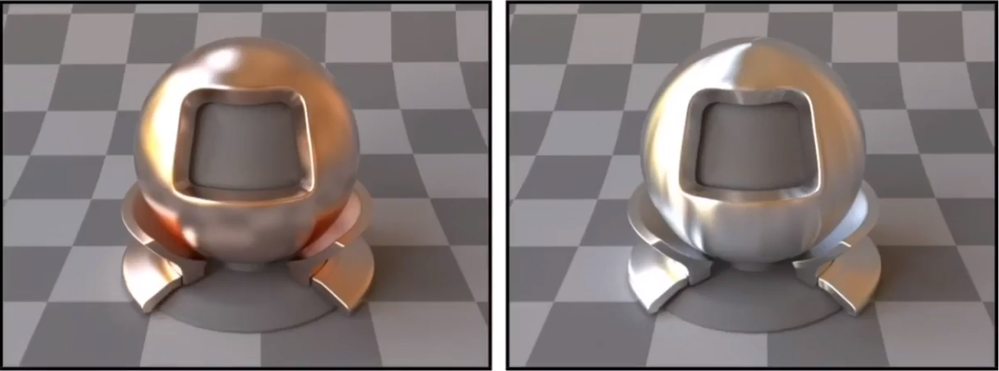

- 透明材质（Ideal reflective/refractive）

  - **描述：**部分光可以在一定改变后穿过材质

    

    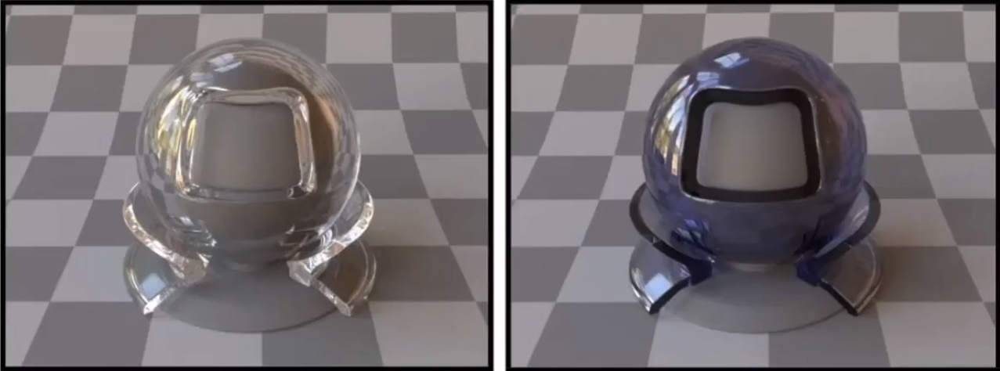

- **计算反射**

    - **反射定律：**入射光，反射光相对法线对称

      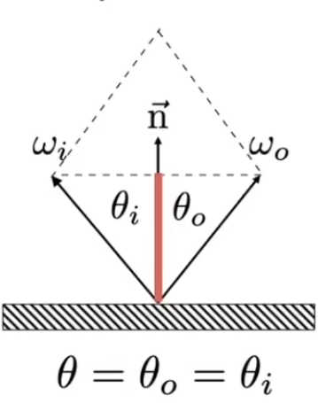

    $$
    \begin{aligned}
    w_o+w_i&=2\cos{\theta}\ \vec{n}=2(w_i\sdot \vec{n})\vec{n}\\
    w_o&=-w_i+2(w_i\sdot\vec{n})\vec{n}
    \end{aligned}
    $$

    - **俯视投影：**我们将角度向量从上向下投影，然后将角度模$ 2\pi$

      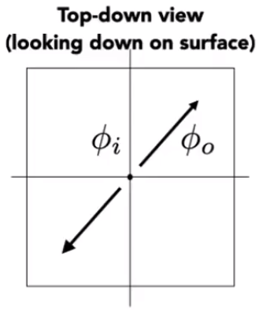

    $$
    \phi_o=(\phi_i+\pi)mod2\pi
    $$
    
    ​	
    
    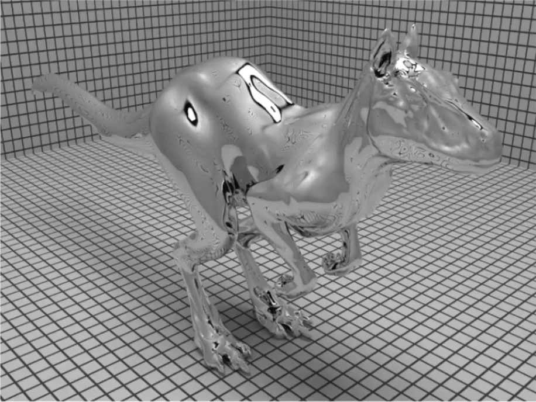
    
- **计算折射**

    - **折射定理：**入射光角度与折射光角度的正弦成比例，比值为折射率
    
      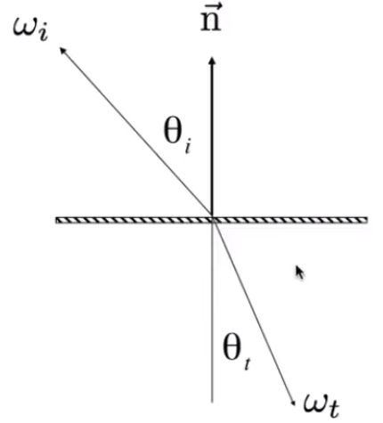
      $$
      \eta_i\sin{\theta_i}=\eta_t\sin{\theta_t}
      $$
    
    - **俯视投影：**我们将角度向量从上向下投影，然后将角度加$ 2\pi$
    
      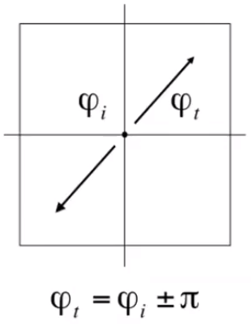
    
    - **计算折射角余弦：**
      $$
      \begin{aligned}
      \cos{\theta_t}&=\sqrt{1-\sin^2{\theta_t}}\\
      &=\sqrt{1-\left(\frac{\eta_i}{\eta_t}\right)^2\sin^2{\theta_i}}\\
      &=\sqrt{1-\left(\frac{\eta_i}{\eta_t}\right)^2(1-\cos^2{\theta_i})}
      \end{aligned}
      $$
    
    - **为什么是余弦？**
    
      如果是余弦就意味着$ 1-\left(\frac{\eta_i}{\eta_t}\right)^2(1-\cos^2{\theta_i})<0$，这意味着$ \eta_i>\eta_t$,这就意味着发生了全反射
    
    - Snell`s Window/Circle
    
      人在高折射区域视野收缩为锥形

	<table>
		<td>
			
		</td>
		<td>
			
		</td>
	</table>
	
- 菲涅尔项（Fresnel Reflection/Term）

    - **目的：**用以定义反射和折射的能量保留与入射光角度关系

        

        <table>
        	<td>
        		
               <p align="center">绝缘体的菲涅尔项</p><b></b>
        	</td>
        	<td>
        		
                <p align="center">导体的菲涅尔项</p>
        	</td>
        </table>

    - **极化算法（现实）：**S和P是两类不同极化的光波，计算的时候也要分别计算
        $$
        \begin{aligned}
        R_s&=\left|{\frac{n_1\cos\theta_i-n_2cos\theta_t}{n_1cos\theta_i+n_2cos\theta_t}}\right|^2\\
        &=\left|{\frac{n_1cos\theta_i-n_2\sqrt{1-\left({\frac{n_1}{n_2}sin\theta_i}\right)^2}}
        {n_1cos\theta_i+n_2\sqrt{1-\left({\frac{n_1}{n_2}sin\theta_i}\right)^2}}}\right|\\
        R_p&=\left|{\frac{n_2cos\theta_t-n_1\cos\theta_i}{n_2cos\theta_t+n_1cos\theta_i}}\right|^2\\
        &=\left|{\frac{n_2\sqrt{1-\left({\frac{n_1}{n_2}sin\theta_i}\right)^2}-n_1cos\theta_i}
        {n_2\sqrt{1-\left({\frac{n_1}{n_2}sin\theta_i}\right)^2}-n_1cos\theta_i}}\right|\\
        R_{eff}&=\frac12(R_s+R_p)
        
        
        \end{aligned}
        $$

    - **简化算法：**不考虑极化模型
        $$
        \begin{aligned}
        R(\theta)&=R_0+(1-R_0)(1-cos\theta)^5\\
        R_0&=\left({\frac{n_1-n_2}{n_1+n_2}}\right)^2
        \end{aligned}
        $$

    - **扩展：**导体的折射率是复数

- **微表面模型（Microfacet Theory）**

    - **定义：**所谓材质的本质是物体表面的微小几何镜面构成

        

    - 由此，我们可以将glossy转变成为物体表面的微表面法线分布

        
        $$
        f(i,o)=\frac{\overbrace{F(i,h)}^{[Fresnel\ term]}\overbrace{G(i,o,h)}^{[shadowing-masking\ term]}\overbrace{D(h)}^{[distribution\ of\ normals]}}{4(n,i)(n,o)}
        $$

        - **Fresnel term:**菲涅尔项
        - **shadowing-masking term：**微表面突起自我遮挡
        - **distribution of normals：**法线的随机分布

<table>
    <tr>
        <td>
            
        </td>
        <td>
          
        </td>
    </tr>
<tr>
		<td>
            
        </td>
        <td>
          
        </td>
    </tr>
</table>

- **各向异性**

  ​	

  - 我们对材质在对不同法向的光有不同的表现称为材质的**各向异性**

    
    $$
    f_r(\theta_i,\phi_i;\theta_r,\phi_r)\neq f_r(\theta_i,\phi_r;\theta_r-\phi_i)
    $$

<table>
	<td>
		
        <p align="center">尼龙在十字方向的各向异性</p><b></b>
	</td>
	<td>
		
        <p align="center">天鹅绒的表面随机分布各向异性（想想拨动沙发表面的毛）</p><b></b>
	</td>
</table>


- **BRDF的基本性质：**

  - **非负性（Non-negativity）**
    $$
    f_r(w_i\rightarrow w_r)\geq0
    $$

  - **线性性质（Linearity）：**对不同模型模拟后可以叠加
    $$
    L_r(p,w_r)=\int_{H^2}f_r(p,w_i\to w_r)L_i(p,w_i)cos\theta_idw_i
    $$
    

  - **可逆性（Reciprocity principle）**
    $$
    f_r(w_r\to w_i)=f_r(w_i\to w_r)
    $$
    
    
  - **能量守恒（Energy conservation）**
    $$
    \forall w_r\int_{H^2}f_r(w_i\to w_r cos\theta_i dwi\leq 1)
    $$
  
  - **各向同性和各向异性（Isotropic vs. anisotropic）**
  
    - 对有各向异性：$ f_r(\theta_i,\phi_i;\theta_r,\phi_r)\neq f_r(\theta_i,\phi_r;\theta_r-\phi_i)$
  
    - 因为光路可逆性，得到：
      $$
      f_r(\theta_i,\theta_r,\phi_r-\phi_i)=f_r(\theta_r,\theta_i,\phi_i-\phi_r)=f_r(\theta_i,\theta_r,|\phi_r-\phi_i|)
      $$
      

### BRDF的测量

- 尽管我们尽力丰富了模型，但是自然模型的BRDF显然还是比我们预想的复杂

  

- **测量方法：**固定材质样本，通过改变光源和相机的位置获得材质

  

  !(计算机图形学入门/image/gonioreflectometer.png)

<table>
	<td>
		
	</td>
	<td>
		
        <p align="center">gonio reflectometer</p><b></b>
	</td>
</table>

- **好用的BRDF库：**MERL BRDF Database

  

## :rainbow:无偏与一致（Biased&Consistent）

- 不会产生模糊的方法:point_right:无偏方法
- 采样级别与结果质量正相关:point_right:具有一致性

## 高级计算机材质和图形

- 无偏光线传播方法（Unbiased light transport methods）
  - 双向路径追踪（Bidirectional path tracing，BDPT）
  - Metropolis light transport（MLT）
- 有偏光线传播方法（Biased light transport methods ）
  - 光子映射（Photon mapping）
  - Vertex connection and merging（VCM）
- 实时辐射度算法（Instant radiosity ，VPL/many light methods）

### 双向路径追踪（Bidirectional Path Tracing，BDPT）

- **概念：**在追踪摄像机“光线”的同时从光源发生另外数条“光线”，对这条光线和摄像机光线进行连线采样。

  

- **成果：**大幅度降低间接光源采样不充分造成的噪点

  
  
- **缺陷：**过于消耗性能（一个光源当几个采样）

### Metropolis light transport（MLT）

- **马尔可夫链蒙特卡罗（Markov Chain Monte Carlo, MCMC）：**马尔可夫过程将过去对未来产生的影响用一个**状态** $ X_n$ 来表示，这个状态会随着过程地进行不断发生变化，并属于有限的状态集合$S$。马尔可夫蒙特卡洛方法是一种算法的集合，可以利用马尔可夫链去模拟复杂的分布模型，对指定的分布模型进行随机采样。该方法极大地扩展了可以模拟的分布模型，比如高维度的联合分布等。

- **概念：**通过马尔可夫链蒙特卡罗对已有的Path进行分析来预测其他path的情况，以此达成图形学目的

  

- **成果：**特别适合特别复杂的光路传播模型，只要将一条正确传播的光路作为种子就可以迅速完成附近的光路的计算

  - 左边的光路从门后面发生完全漫反射的照亮室内
  - 右边是光线经过水面波纹聚焦产生的焦散（caustics）
  
  
  
- **缺陷：**难以直接分析结果的质量，结果质量不稳定，容易出现很“脏”的地方

  

### 光子映射（Photon Mapping）


- **动机：**为了解决Specular-Diffuse-Specular（SDS）类型路径产生的caustics渲染质量不好的问题而出现

- **其中一种实现：**

  1. Photon从光源出发，完成若干传播，直到接触到一个Diffuse表面

     
     
  2. sub-path从摄像机出发，经过若干传播，直到接触到一个Diffuse表面

  3. 在sub-path附近开始对Photon进行局部路径估计（local density estimation）

     - 取一个sub-path周围最近的n个光子，求此n个光子占用面积
     - n除去面积得到密度

     

- **缺陷：**n过低会有很多噪点，n过高会糊

  

  - **原因：**我们用一个区域的的光子密度代替了一个点的光子密度,所以该方法为有偏方法（Biased）
    $$
    dN/dA\neq \Delta N/\Delta A
    $$

- **优势：**我们只要打出更多的Poton，n个Poton的平均区域就会更小，$ dA\to \Delta A$,所以该方法具有一致性（consistent）

### Vertex connection and merging（VCM）

- **原理：**定义一个阈值距离r，同时射出光源路径和摄像机路径；双方路径经过若干传播，直到接触到一个Diffuse表面，开始检验。

  - 如果光线路径和摄像机路径入射点距离超过阈值r或者不在一个表面则对这两条路径进行DBPT

  - 如果光线路径和摄像机路径入射点距离不超过阈值r，且存在一个表面，将光源路径作为Photon然后光子映射

    

### 实时辐射度算法（Instant radiosity，IR）

- **原理：**将光源射出的光线记录在表面，然后将其看作虚拟点光源（Virtual point light，VPL），在采样时当成VPL在照射

  

- 成果与缺陷：

  - 非常善于解决大量光源的情况

  - 但是在一些物体接缝折痕处会出现莫名的点光源

  - IR不能做金属（Glossy）的物体

    

## 高级外观建模（Advanced Appearance Modeling）

### 非片元模型（Non-Surface Models）

- 散射介质（Participanting Media）

  像雾气（Fog）或者云（Cloud）这样影响线传播的非实物体

  

  - **定义：**相位函数（Phase Function）

    

  - **渲染：**每隔一段进行一次路径散射

    

  - **成果：**

    - 雾气弥漫的城市

    

    - 在微微透光的物体里也有散射
    
    
  
- 毛发材质（Hair Appearance）

  

  - Kajiya-Kay Model

    对一切发丝的散射考虑为发丝径向的漏斗形散射和周围散射的组合

    

    - **效果：**

    

  - Marschner Model

    对于入射光线我们假定存在以下三类反射光

    - R：被发丝反射向四面八方
    - TT：从发丝穿过受到两次折射的光
    - TRT：折射进入发丝又被反射出来的光

    

    - 所以该模型将头发分为有部分反射性能的外皮（cuticle）和均匀分布了色素但是可以透射的内部（cortex）
    
      
    
    - 成果：
    
      
    
    - **缺陷：**人的头发和动物的毛发渲染结果并不相同
    
      
    
  - Double Cylinder Model（Creat by 闫令琪，大佬NB！！）

    可以看到毛发是三层结构

    

    - **表皮（Cuticle）：**具有部分反射性
    - **内层（Cortex）：**可以透射，色素会吸收部分光线
    - **髓质（Medulla）：**就会直接散射到四面八方
    
    一般动物的毛发髓质部分大于人类毛发，所以Marschner Model只是一种近似情况
    
    - 
    
      
    
    - 所以我们需要在原有Marschner Model基础上增加TT^s^和TRT^s^两种情况
    
      
    
      
  
- 颗粒材质（Granular Material）

  业界没有特别好的解决办法

  

### 片元模型（Surface Models）

- Translucent Material

  

  - 次表面散射（Scattering Functions）
    - **BSSRDF：**BRDF的扩展，允许光线通过物体表面，在若干变化后离开
    
      - **x~i~：**光线进来的位置
      - **w~i~：**光线进来的方向
      - **x~o~：**光线离开的位置
      - **w~o~：**光线离开的方向
    
      $$
      L(x_o,w_o)=\int_A\int_{H^2}S(x_i,w_i,x_o,w_o)L_i(x_i,w_i)\cos\theta_idw_idA
      $$
    
      
    
    - Dipole Approximation
    
      对于次表面散射，我们可以用在表面上方和下方分别生成一个光源来照射该区域近似
    
      
    
    - **成果：**
    
      
  
- 布料

  - 布料的编制顺序为：
    $$
    fibers\to ply\to yarn \to cloth
    $$
    

  - **思路1：**将编织物看作一个表面

    

    

  - **思路2：**对部分织物应当视为空间体积

    

  - **思路3：**对每个fiber进行渲染

    

- 做旧

  真实世界充满了划痕，污渍和粗糙

  

  - 再谈微表面模型（Microfacet BRDF）

    如果你用一个相对理想的模型去描述物体材质，材质就会显的过于理想

    

    **下面两个模型大概渲染了一个月**

    

    

  - 对微表面模型的BRDF分布进行统计处理，减少在表面多次反射产生的性能浪费

    

    一些特殊的表面法线分布就会更加独特

    

- 超越几何光学

  

  

  

### 程序化生成

- **优势：**

  - 减少存储空间和内存占用
  - 减少人力成本

- **实现：**

  基于各种Noise函数变化

  - Perlin Noise
  - Gauß Noise
  - Poisson Nosie…

- 成果：

  <table>
  	<td>
  		
          <p align="center">噪音山</p><b></b>
  	</td>
  	<td>
  		
          <p align="center">噪音洋面</p><b></b>
  	</td>
  </table>

## 相机，棱镜和光场

### 相机原理


- 快门（Shutter）：控制通光时间
  - 针孔照相机
  - 棱镜式相机
- 传感器（Sensor）：记录irradiance

### 视场（Field of View，FOV）


$$
FOV=2arctan\left(\frac{h}{2f}\right)
$$

- **定义：**填满35mm胶片所需要的焦距大小


### 曝光（Exposure）

$$
H_{Exposure}=T_{time}\times E_{irradiance}
$$

- **定义：**曝光时间内单位像素接收的irradiance

  - **快门速度**决定曝光时间
  - 光圈决定irradiance通过比率
  - 感光度（ISO）对曝光结果的比率修正

  

- **光圈单位：**FN或者F/N，其中N为焦距除以直径

- **运动模糊：**拍摄物体在受到拍摄时间内运动导致曝光不准确的结果

- **Rolling shutter：**由于曝光始末不均匀产生的变形

  

- **凸透镜公式（Gauss‘Ray Thin Lens Equation）：**
  $$
  \frac1f=\frac1z_i+\frac1z_0
  $$
  

  

- **景深：**物体成像模糊程度和与焦距距离和光圈大小有关
  $$
  \frac CA=\frac{a'}{z_i}=\frac{|z_s-z_i|}{z_i}
  $$
  

  


### 虚焦光线追踪（Ray Tracing for Defocus Blur）


- 思路：
  - 

