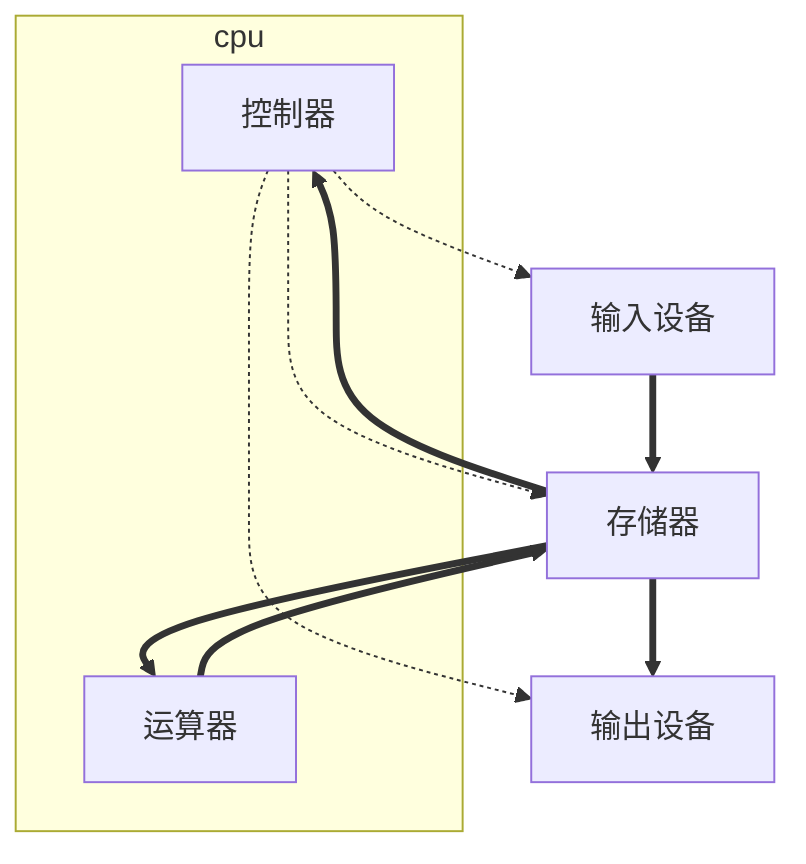
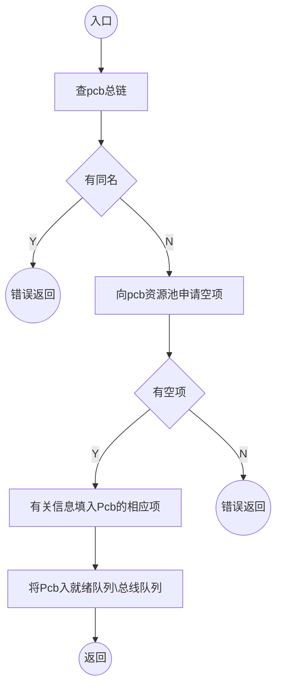

# 计算机操作系统原理

- 参考书籍：
  - 《计算机操作系统》
  - 《Unix操作系统》
  - 《Windows操作系统原理》
  - 《操作系统——习题与解析》**考研**

## 第一章：绪论

- 操作系统的定义，功能，形成和发展
- 与计算机结构的关系，特性及其解决问题

### Von Neumann计算机

- 理论：存储程序自动运行
- 结构：五大组成部分相互关系

- 特点：集中顺序控制
- 矛盾
  - 集中控制与并行化处理需求的矛盾
  - 复杂的使用控制过程与使用者简化要求的矛盾
  - 昂贵的设备与低使用效率矛盾
  - 浩瀚的软件信息管理工作与高效的工作要求间的矛盾
  - 速度难以提高与高速运行需求间的矛盾

