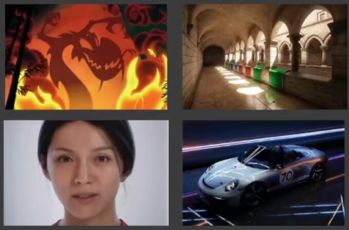

# 高质量实时渲染（Real-Time High Quality Rendering）

课程:book:：**GAMES202**

讲师:person_frowning:：**闫令琪**

## :star2:目录

[TOC]

## 进入高质量实时渲染

- **实时（Real-Time）渲染：**30 FPS（Frames per Second）是实时渲染的基本门槛

  在VR/AR领域是90 FPS

- **高质量（High Quality）：**目标是以假乱真，保证接近正确的高效的物理模型

- **:star:课程大纲:**

  

  - 阴影（Shadows and env）
  - 全局光照（Global illum. Scene/image space, precomputed）
  - 真实着色（Physically-Physically-based Shading）
  - 实时光线追踪（Real-time ray tracing）

